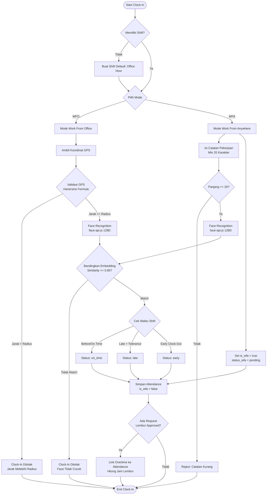
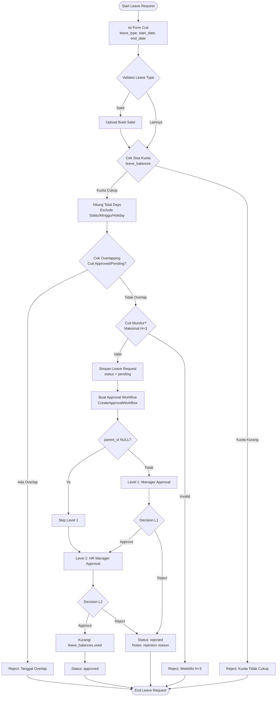
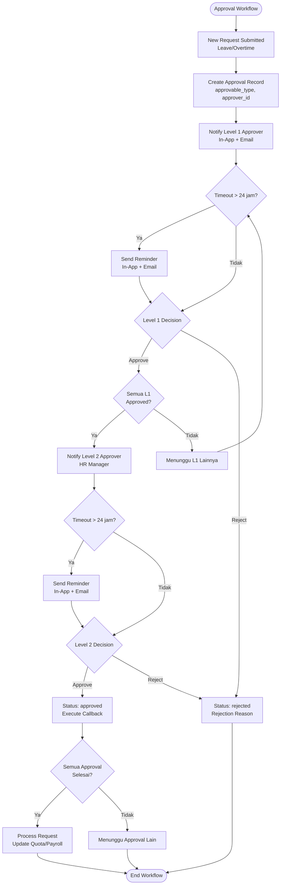
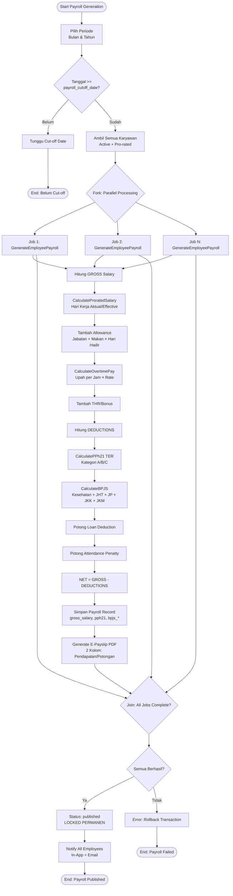
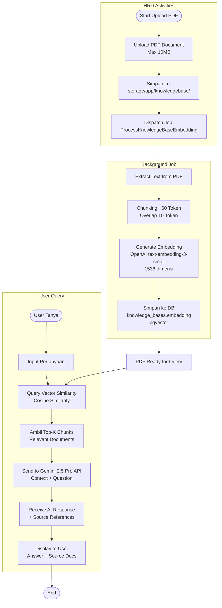
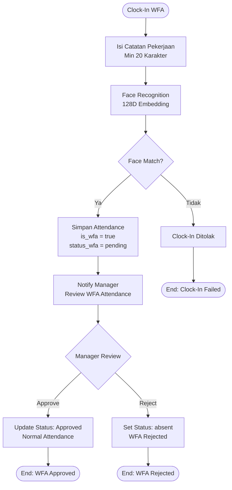

# Activity Diagrams - HRConnect HRIS

## Deskripsi
Dokumen ini menyajikan diagram Activity UML untuk sistem HRConnect HRIS yang menggambarkan alur kerja (workflow) dari proses-proses bisnis utama. Diagram ini menggunakan swimlanes untuk memisahkan aktivitas berdasarkan aktor dan sistem, serta menunjukkan decision points, fork/join nodes, dan flow directions sesuai dengan business rules dalam PRD.

---

## 1. Activity Diagram - Clock-In/Out (WFO + WFA)

---

## 2. Activity Diagram - Leave Request

---

## 3. Activity Diagram - Approval Workflow

---

## 4. Activity Diagram - Payroll Generation

---

## 5. Activity Diagram - KnowledgeBase AI RAG

---

## 6. Activity Diagram - WFA Approval After Clock-In

---

## Business Rules Reference (PRD)

1. **Haversine Formula**: Validasi jarak GPS titik ke titik dengan radius tolerance per branch (PRD 2.2, 6.1)
2. **Face Recognition**: face-api.js client-side dengan 128D FaceNet embedding, threshold 0.85 (PRD 2.1, 6.1)
3. **WFA Note**: Wajib isi catatan ≥20 karakter untuk Work From Anywhere (PRD 6.1)
4. **Leave Calculation**: Exclude Sabtu, Minggu, holidays; morning/afternoon = 0.5 hari (PRD 7.2)
5. **Leave Retroaktif**: Maksimal H+3 dari tanggal cuti (PRD 7.2)
6. **Approval Workflow**: 2 Level (Manager L1 → HR Manager L2), skip L1 jika parent_id NULL (PRD 12.1)
7. **Payroll Cut-off**: Default tanggal 25, join setelah cut-off masuk bulan depan (PRD 11.1)
8. **Prorated Salary**: (Hari Kerja Aktual / Hari Kerja Efektif) × Gaji Pokok (PRD 11.3)
9. **PPh21 TER**: Kategori A/B/C berdasarkan PTKP dari marital_status + jumlah anak (PRD 11.4)
10. **BPJS**: Kesehatan 4%/1%, JHT 3.7%/2%, JP 2%/1%, ceiling di bpjs_configs (PRD 11.5)
11. **Payroll Lock**: Status published → LOCKED PERMANEN, koreksi via adjustment (PRD 11.7)
12. **KnowledgeBase AI**: PDF max 10MB, chunking 60 token, OpenAI embedding 1536D, Gemini 2.5 Pro LLM (PRD 13.1)
13. **WFA Approval**: Approval SETELAH clock-in, jika reject status bisa jadi absent (PRD 6.1)
