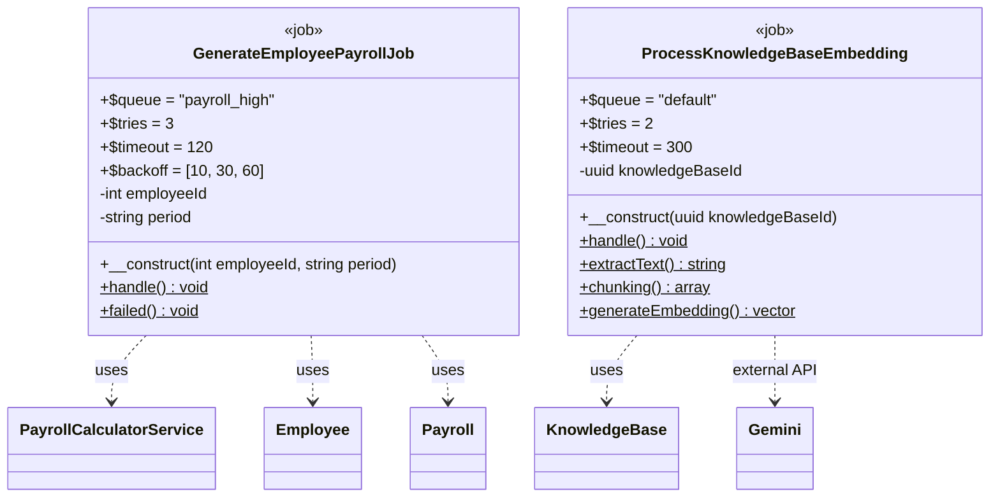
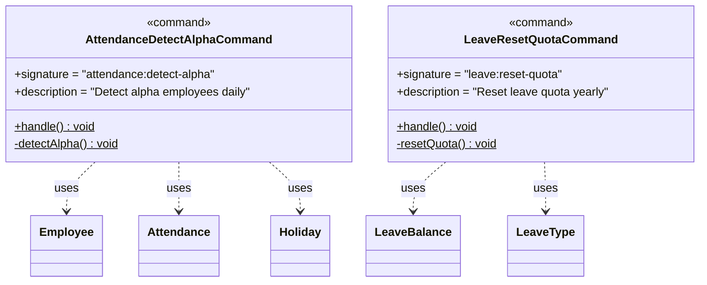
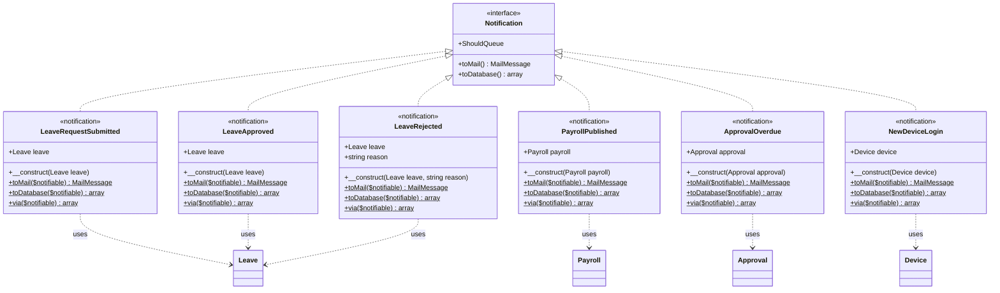
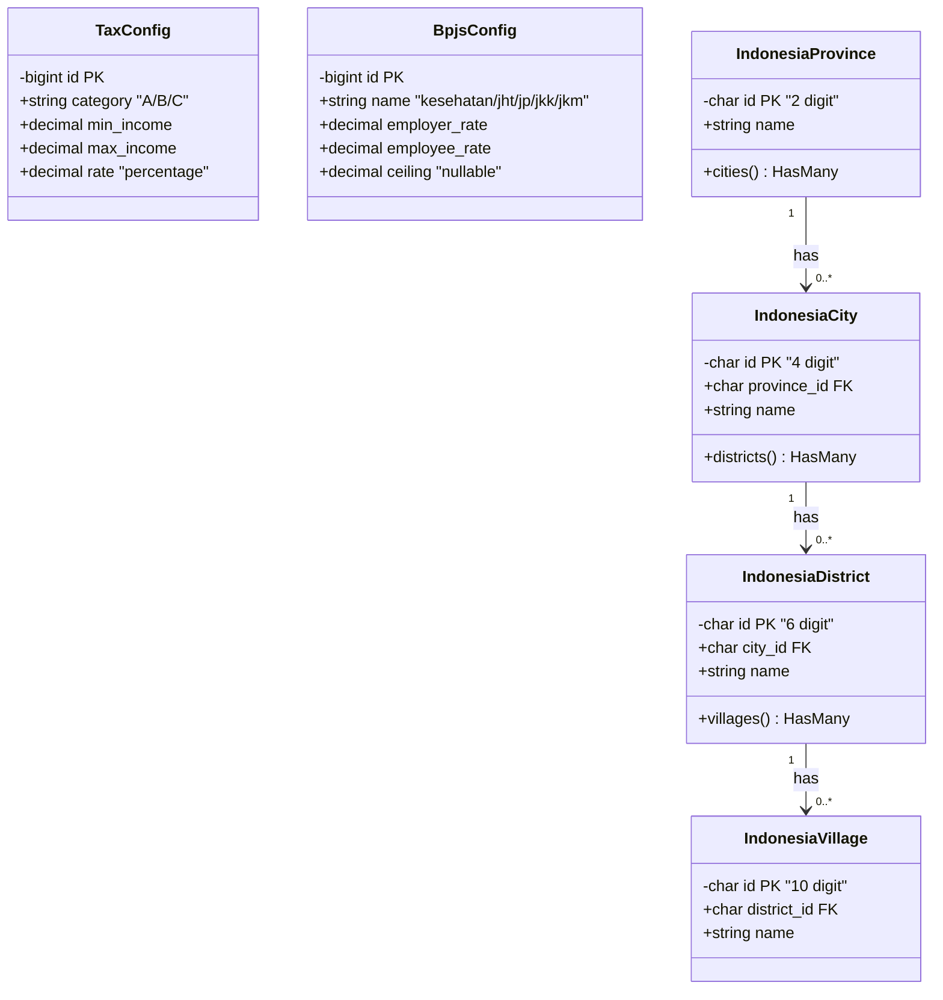

# Class Diagram - HRConnect HRIS

## Errata

> **Peringatan:** Catatan berikut mengidentifikasi masalah (bugs, ketidakakuratan, item yang hilang) dalam diagram ini yang harus diperbaiki saat implementasi.

1. **C1: ApprovalLevel enum comparison bug** — Approval model casts `level` to `ApprovalLevel` enum. Comparisons like `$approval->level === 1` are ALWAYS false. Use `$approval->level->value === 1` or `$approval->level === ApprovalLevel::L1_SUPERVISOR`. See `Approval` class below.
2. **C2: Payroll forceDelete** — `$existingPayroll->delete()` only sets `deleted_at` (SoftDeletes). Use `forceDelete()` to avoid unique constraint violation when regenerating payroll for the same employee+period.
3. **C3: Sanctum not installed** — `HasApiTokens` trait is missing from the `User` model. API authentication (`routes/api.php`) requires `laravel/sanctum` which is not yet installed.
4. **C4: Permission enum + RoleAndPermissionSeeder missing** — The `Permission` enum and `RoleAndPermissionSeeder` referenced in the blueprint have not been created. Authorization checks (`$user->can()`) will always return false.
5. **SEC-5: BusinessRuleException HTTP 422** — `BusinessRuleException` should extend `HttpException` with status code 422, not the base `Exception` class (which returns 500). All business rule violations must return HTTP 422.
6. **PayrollAdjustment.amount should be decimal(15,2) not integer** — The `amount` field is listed as `integer` but must be `decimal(15,2)` since payroll adjustments involve fractional monetary values.
7. **PayrollAdjustment.created_by should be nullable** — The `created_by` FK should be nullable (`?bigint`) because system-generated adjustments may not have a user author.
8. **Employee model missing PII fields in `$hidden`** — The `$hidden` array on the Employee model must include `nik`, `npwp`, `bank_account_number`, and `phone` to prevent PII exposure in API responses.
9. **KnowledgeBase model missing vector cast for embedding field** — The `embedding` field requires a cast to `vector` type (via `pgvector` package) in the model's `$casts` array.
10. **Asset model using `is_available` boolean instead of `AssetStatus` enum** — The `Asset` model should use the `AssetStatus` enum (available/assigned/disposed) instead of a boolean `is_available`. Asset model is also missing `SoftDeletes` and `timestamps`.
11. **FamilyDetail model missing encrypted fields** — `nik`, `phone`, and `address` fields on `FamilyDetail` are marked as encrypted but the model needs proper `$casts` or CipherSweet encryption setup.
12. **Attendance model missing verification_method split (ERR-004)** — Per ERR-004, Attendance should have 4 separate columns: `clock_in_verification_method`, `clock_in_face_similarity_score`, `clock_out_verification_method`, `clock_out_face_similarity_score` instead of a single `status` or combined field.

## Deskripsi
Dokumen ini menyajikan diagram Class UML untuk sistem HRConnect HRIS yang menggambarkan seluruh Models (25 existing + 4 new), Service classes (4), Jobs (2), Commands (2), Notifications (6), dan Enums (17). Diagram menunjukkan relationships (composition, aggregation, inheritance, dependency), method signatures, dan property types sesuai dengan arsitektur Laravel yang didefinisikan dalam PRD.

---

## 1. Class Diagram - Models (31 Total)

```mermaid
classDiagram
    %% Base Model (Implicit in Laravel)
    class Model {
        <<abstract>>
        +timestamps
        +softDeletes()
    }
    
    %% Existing Models (25)
    class User {
        -bigint id PK
        +string name
        +string email
        +timestamp email_verified_at
        +string password
        +string phone
        +boolean password_changed
        +string two_factor_secret
        +string two_factor_recovery_codes
        +timestamp created_at
        +timestamp updated_at
        +employee() Employee
        +getEmployee() Employee
        ⚠️ ERRATA C3: Missing HasApiTokens trait (requires laravel/sanctum)
    }
    
    class Company {
        -bigint id PK
        +string name
        +string phone
        +string email
        +string website
        +string npwp "encrypted"
        +string code
        +string logo
        +boolean is_active
        +branches() HasMany
        +users() HasMany
        +settings() HasMany
    }
    
    class Branch {
        -bigint id PK
        +bigint company_id FK
        +string name
        +text address
        +decimal latitude
        +decimal longitude
        +integer radius "default: 100m"
        +boolean is_main
        +boolean is_active
        +company() Company
        +departments() HasMany
        +validateRadius(lat, lng, radius)$ bool
    }
    
    class Department {
        -bigint id PK
        +bigint branch_id FK
        +string name
        +string code
        +text description
        +boolean is_active
        +branch() Branch
        +positions() HasMany
    }
    
    class Position {
        -bigint id PK
        +bigint department_id FK
        +string name
        +string code
        +string grade
        +decimal basic_salary
        +decimal allowance_jabatan
        +boolean is_active
        +department() Department
        +employees() HasMany
    }
    
    class Employee {
        -bigint id PK
        +bigint user_id FK
        +bigint position_id FK
        +bigint parent_id FK "manager"
        +string nik "encrypted, blind_index"
        +string name
        +string phone "encrypted, blind_index"
        +string address
        +date birth_date
        +string marital_status
        +string bank_account_number "encrypted, blind_index"
        +string bank_name
        +date join_date
        +date resign_date
        +string employment_status
        +string employment_type "permanent/contract/probation"
        +date contract_start_date
        +date contract_end_date
        +date deceased_date
        +text termination_reason
        +string face_embedding "vector(128)"
        +string npwp "encrypted, blind_index"
        +bigint shift_id FK
        +timestamps
        +softDeletes
        ⚠️ ERRATA: $hidden must include nik, npwp, bank_account_number, phone
        +user() User
        +position() Position
        +parent() Employee "manager"
        +children() HasMany "subordinates"
        +attendances() HasMany
        +leaves() HasMany
        +overtimes() HasMany
        +payrolls() HasMany
        +familyDetails() HasMany
        +devices() HasMany
        +leaveBalances() HasMany
        +approvals() HasMany "as approver"
        +getDirectApprover()$ Employee
    }
    
    class Shift {
        -bigint id PK
        +string name
        +time start_time
        +time end_time
        +integer late_tolerance_minutes "default: 0"
        +boolean is_active
        +employees() HasMany
        +attendances() HasMany
        +shiftSchedules() HasMany
    }
    
    class Attendance {
        -bigint id PK
        +bigint employee_id FK
        +bigint shift_id FK
        +time clock_in
        +time clock_out
        +decimal clock_in_latitude
        +decimal clock_in_longitude
        +decimal clock_out_latitude
        +decimal clock_out_longitude
        +string clock_in_verification_method ⚠️ ERRATA ERR-004: Split verification into 4 columns
        +decimal clock_in_face_similarity_score
        +string clock_out_verification_method
        +decimal clock_out_face_similarity_score
        +string clock_in_photo
        +string clock_out_photo
        +string status "on_time/late/early/holiday/permission/absent"
        +boolean is_wfa "default: false"
        +string status_wfa "pending/approved/rejected"
        +string wfa_note
        +integer late_minutes
        +bigint overtime_id FK
        +softDeletes
        +employee() Employee
        +shift() Shift
        +overtime() Overtime
    }
    
    class LeaveType {
        -bigint id PK
        +string name
        +integer quota "default: 12"
        +boolean is_paid
        +boolean deducts_from_quota "default: true"
        +boolean is_active
        +leaves() HasMany
        +leaveBalances() HasMany
        +isPaid()$ bool
        +deductsFromQuota()$ bool
    }
    
    class Leave {
        -bigint id PK
        +bigint employee_id FK
        +bigint leave_type_id FK
        +date start_date
        +date end_date
        +string day_type "full_day/morning/afternoon"
        +decimal total_days
        +string status "pending/approved/rejected"
        +text rejection_reason
        +softDeletes
        +employee() Employee
        +leaveType() LeaveType
        +approvals() MorphMany
        +calculateTotalDays()$ float
        +validateQuota()$ bool
    }
    
    class Overtime {
        -bigint id PK
        +bigint employee_id FK
        +bigint attendance_id FK "nullable"
        +time start_time
        +time end_time
        +text description
        +string status "pending/approved/rejected"
        +text rejection_reason
        +decimal total_hours
        +decimal amount
        +softDeletes
        +employee() Employee
        +attendance() Attendance
        +approvals() MorphMany
    }
    
    class Payroll {
        -bigint id PK
        +bigint employee_id FK
        +string period "YYYY-MM"
        +decimal basic_salary
        +decimal total_allowance
        +decimal gross_salary
        +decimal overtime_pay
        +decimal pph21
        +decimal bpjs_health
        +decimal bpjs_employment
        +decimal loan_deduction
        +decimal attendance_penalty
        +decimal total_deduction
        +decimal net_salary
        +string status "draft/published/paid"
        +softDeletes
        +employee() Employee
        +items() HasMany
        +adjustments() HasMany
        +isLocked()$ bool
        +generatePdf()$ void
        ⚠️ ERRATA C2: When regenerating payroll, use forceDelete() to avoid unique constraint violation
    }
    
    class PayrollItem {
        -bigint id PK
        +bigint payroll_id FK
        +string type "allowance/deduction"
        +string name
        +decimal amount
        +payroll() Payroll
    }
    
    class PayrollAdjustment {
        -bigint id PK
        +bigint payroll_id FK "original payroll"
        +decimal amount "⚠️ ERRATA: Must be decimal(15,2), NOT integer"
        +text reason
        +bigint created_by FK "⚠️ ERRATA: Must be nullable"
        +date applied_to_period
        +payroll() Payroll
        +creator() User
    }
    
    class FamilyDetail {
        -bigint id PK
        +bigint employee_id FK
        +string nik "encrypted, blind_index"
        ⚠️ ERRATA: nik, phone, address must use CipherSweet encryption in model
        +string name
        +string relationship
        +date birth_date
        +string phone "encrypted, blind_index"
        +string address "encrypted"
        +employee() Employee
    }
    
    class Device {
        -bigint id PK
        +bigint employee_id FK
        +string uuid "device UUID"
        +boolean is_verified "default: false"
        +string device_name
        +employee() Employee
    }
    
    class Approval {
        -bigint id PK
        +string approvable_type "polymorphic"
        +bigint approvable_id
        +bigint approver_id FK "employee_id"
        +ApprovalLevel level "⚠️ ERRATA C1: Cast to enum! Use ApprovalLevel::L1_SUPERVISOR/L2_MANAGER, NOT integer comparison"
        +string status "pending/approved/rejected"
        +text notes
        +approver() Employee "approver"
        +approvable() MorphTo
    }
    
    class Holiday {
        -bigint id PK
        +date date "unique"
        +string name
        +boolean is_active
        +isHoliday(date)$ bool
    }
    
    class KnowledgeBase {
        -bigint id PK
        +string title
        +string file_path
        +text content "chunked"
        +vector embedding "vector(768)"
        ⚠️ ERRATA: $casts must include 'embedding' => \Pgvector\Laravel\Vector::class
        +string source_document
        +integer page_number
        +string status "processing/ready/error"
        +knowledgeable() MorphTo
        +processEmbedding()$ void
    }
    
    class ActivityLog {
        -bigint id PK
        +string log_name
        +string description
        +string subject_type "polymorphic"
        +bigint subject_id
        +string causer_type "polymorphic"
        +bigint causer_id
        +json properties
        +prunable()$ Builder
    }
    
    class Asset {
        -bigint id PK
        +bigint company_id FK
        +string name
        +string code
        +string category
        +AssetStatus status "⚠️ ERRATA: Use AssetStatus enum instead of is_available boolean"
        ⚠️ ERRATA: Missing SoftDeletes and timestamps
    }
    
    class AssetHandover {
        -bigint id PK
        +bigint asset_id FK
        +bigint employee_id FK
        +date handover_date
        +date return_date
        +string condition
    }
    
    class PerformanceReview {
        -bigint id PK
        +bigint employee_id FK
        +integer period_year
        +integer period_month
        +decimal score
        +text feedback
    }
    
    class Reimbursement {
        -bigint id PK
        +bigint employee_id FK
        +bigint payroll_id FK "nullable"
        +string title
        +date expense_date
        +decimal amount
        +string receipt_file "nullable"
        +text rejection_reason "nullable"
        +string status "pending/approved/rejected/paid"
        +softDeletes
    }
    
    class Loan {
        -bigint id PK
        +bigint employee_id FK
        +text rejection_reason "nullable"
        +bigint created_by FK
        +decimal amount
        +integer tenor_months
        +decimal monthly_installment
        +string status "pending/approved/rejected/active/paid_off/cancelled"
        +boolean is_settled "default: false"
        +softDeletes
    }
    
    class LoanInstallment {
        -bigint id PK
        +bigint loan_id FK
        +bigint payroll_id FK "nullable"
        +decimal amount_paid
        +integer installment_number
        +string status "default: pending"
        +date due_date
        +timestamp paid_at "nullable"
    }
    
    %% NEW Models (4)
    class CompanySetting {
        -bigint id PK
        +string key
        +text value
        +string description
        +get(key, default)$ mixed
        +set(key, value)$ void
    }
    
    class ReimbursementCategory {
        -bigint id PK
        +string name
        +string description
        +boolean is_active
    }
    
    class ShiftSchedule {
        -bigint id PK
        +bigint employee_id FK
        +bigint shift_id FK
        +date date
        +employee() Employee
        +shift() Shift
    }
    
    class LeaveBalance {
        -bigint id PK
        +bigint employee_id FK
        +bigint leave_type_id FK
        +integer year
        +integer quota
        +integer used
        +integer carry_forward "max: 3"
        +employee() Employee
        +leaveType() LeaveType
        +currentYear(year)$ Builder
        +unique: employee_id + leave_type_id + year
    }
    
    %% Relationships (Associations)
    Company "1" --> "0..*" Branch : has
    Company "1" --> "0..*" User : has
    Branch "1" --> "0..*" Department : has
    Department "1" --> "0..*" Position : has
    Position "1" --> "0..*" Employee : has
    User "1" --> "1" Employee : has one
    Employee "1" --> "0..*" Attendance : has
    Employee "1" --> "0..*" Leave : has
    Employee "1" --> "0..*" Overtime : has
    Employee "1" --> "0..*" Payroll : has
    Employee "1" --> "0..*" FamilyDetail : has
    Employee "1" --> "0..*" Device : has
    Employee "1" --> "0..*" LeaveBalance : has
    Employee "1" --> "0..*" Approval : approver
    Employee "1" --> "0..1" Employee : parent (manager)
    Shift "1" --> "0..*" Employee : assigned
    Shift "1" --> "0..*" Attendance : has
    Shift "1" --> "0..*" ShiftSchedule : has
    LeaveType "1" --> "0..*" Leave : has
    LeaveType "1" --> "0..*" LeaveBalance : has
    Payroll "1" --> "0..*" PayrollItem : has
    Payroll "1" --> "0..*" PayrollAdjustment : has
    Approval "0..*" --> "1" Employee : approver
    Employee "0..*" --> "1" Approval : polymorphic
    
    %% Inheritance (Implicit Laravel Model)
    Model <|-- User
    Model <|-- Company
    Model <|-- Branch
    Model <|-- Department
    Model <|-- Position
    Model <|-- Employee
    Model <|-- Shift
    Model <|-- Attendance
    Model <|-- LeaveType
    Model <|-- Leave
    Model <|-- Overtime
    Model <|-- Payroll
    Model <|-- PayrollItem
    Model <|-- FamilyDetail
    Model <|-- Device
    Model <|-- Approval
    Model <|-- Holiday
    Model <|-- KnowledgeBase
    Model <|-- ActivityLog
    Model <|-- Asset
    Model <|-- AssetHandover
    Model <|-- PerformanceReview
    Model <|-- Reimbursement
    Model <|-- Loan
    Model <|-- LoanInstallment
    Model <|-- CompanySetting
    Model <|-- ReimbursementCategory
    Model <|-- ShiftSchedule
    Model <|-- LeaveBalance
```

---

## 2. Class Diagram - Service Classes (4)

```mermaid
classDiagram
    class PayrollCalculatorService {
        <<service>>
        +calculateProratedSalary(Employee employee, string periodYearMonth)$ float
        +calculatePTKP(Employee employee)$ float
        +getTERCategory(Employee employee)$ string "A/B/C"
        +calculatePPh21(float grossIncome, string category)$ float
        +calculateBPJS(Employee employee, float grossIncome)$ array
        +calculateOvertimePay(Overtime overtime, Employee employee)$ float
        +countWorkingDays(Carbon start, Carbon end)$ int
        +calculateThrProrated(Employee employee, float monthlySalary, int monthsWorked)$ float
    }
    
    class AttendanceService {
        <<service>>
        +clockIn(Employee employee, float lat, float lng, string faceEmbedding, bool isWfa, ?string wfaNote)$ Attendance
        +clockOut(Employee employee, float lat, float lng, string faceEmbedding)$ Attendance
        +validateGPS(float lat, float lng, Branch branch)$ bool "Haversine"
        +validateFace(string liveEmbedding, string storedEmbedding)$ float "similarity score"
        +handleWFA(Attendance attendance)$ void
        +linkOvertimeToAttendance(Attendance attendance)$ void "Observer"
    }
    
    class LeaveService {
        <<service>>
        +calculateWorkDays(Carbon start, Carbon end, string dayType)$ float
        +validateLeaveQuota(Employee employee, LeaveType type, float days)$ bool
        +applyLeave(Leave leave)$ Leave
        +initializeBalance(Employee employee, int year)$ void
        +carryForward(Employee employee, int fromYear, int toYear)$ void
    }
    
    class ApprovalService {
        <<service>>
        +createApprovalWorkflow(Model approvable)$ void
        +approve(Approval approval, string notes)$ void
        +reject(Approval approval, string reason)$ void
        +checkAllApproved(Model approvable)$ bool
        +getDirectApprover(Employee employee)$ Employee
    }
    
    %% Dependencies
    PayrollCalculatorService ..> Employee : uses
    PayrollCalculatorService ..> TaxConfig : uses
    PayrollCalculatorService ..> BpjsConfig : uses
    PayrollCalculatorService ..> Holiday : uses
    
    AttendanceService ..> Employee : uses
    AttendanceService ..> Branch : uses
    AttendanceService ..> Shift : uses
    AttendanceService ..> Overtime : uses
    AttendanceService ..> CompanySetting : uses
    
    LeaveService ..> Employee : uses
    LeaveService ..> LeaveType : uses
    LeaveService ..> LeaveBalance : uses
    LeaveService ..> Holiday : uses
    
    ApprovalService ..> Employee : uses
    ApprovalService ..> Approval : uses
    ApprovalService ..> Leave : uses
    ApprovalService ..> Overtime : uses
```

---

## 3. Class Diagram - Jobs (2)

---

## 4. Class Diagram - Commands (2)

---

## 5. Class Diagram - Notifications (6)

---

## 6. Class Diagram - Enums (17)

```mermaid
classDiagram
    class EmploymentType {
        <<enum>>
        +PERMANENT = "permanent"
        +CONTRACT = "contract"
        +PROBATION = "probation"
    }
    
    class LeaveDayType {
        <<enum>>
        +FULL_DAY = "full_day"
        +MORNING = "morning"
        +AFTERNOON = "afternoon"
    }
    
    class AttendanceStatus {
        <<enum>>
        +ON_TIME = "on_time"
        +LATE = "late"
        +EARLY = "early"
        +HOLIDAY = "holiday"
        +PERMISSION = "permission"
        +ABSENT = "absent"
    }
    
    class WfaStatus {
        <<enum>>
        +PENDING = "pending"
        +APPROVED = "approved"
        +REJECTED = "rejected"
    }
    
    class ApprovalLevel {
        <<enum>>
        +LEVEL_1 = 1
        +LEVEL_2 = 2
    }
    
    class ApprovalStatus {
        <<enum>>
        +PENDING = "pending"
        +APPROVED = "approved"
        +REJECTED = "rejected"
    }
    
    class RequestStatus {
        <<enum>>
        +PENDING = "pending"
        +APPROVED = "approved"
        +REJECTED = "rejected"
    }
    
    class PayrollStatus {
        <<enum>>
        +DRAFT = "draft"
        +PUBLISHED = "published"
        +PAID = "paid"
    }
    
    class PayrollItemType {
        <<enum>>
        +ALLOWANCE = "allowance"
        +DEDUCTION = "deduction"
        +ADJUSTMENT = "adjustment"
    }
    
    class TERCategory {
        <<enum>>
        +A = "A"
        +B = "B"
        +C = "C"
    }
    
    class MaritalStatus {
        <<enum>>
        +SINGLE = "single"
        +MARRIED = "married"
        +WIDOWED = "widowed"
    }
    
    class Gender {
        <<enum>>
        +MALE = "male"
        +FEMALE = "female"
    }
    
    class Relationship {
        <<enum>>
        +SPOUSE = "spouse"
        +CHILD = "child"
        +PARENT = "parent"
        +SIBLING = "sibling"
    }
    
    class AssetStatus {
        <<enum>>
        +AVAILABLE = "available"
        +ASSIGNED = "assigned"
        +DISPOSED = "disposed"
    }
    
    class LoanStatus {
        <<enum>>
        +PENDING = "pending"
        +APPROVED = "approved"
        +PAID = "paid"
        +OFF = "off"
    }
    
    class ReimbursementStatus {
        <<enum>>
        +PENDING = "pending"
        +APPROVED = "approved"
        +REJECTED = "rejected"
    }
    
    class KnowledgeBaseStatus {
        <<enum>>
        +PROCESSING = "processing"
        +READY = "ready"
        +ERROR = "error"
    }
```

---

## 7. Class Diagram - Configuration & Additional Classes

---

## Ringkasan Class Diagram

| Kategori | Jumlah | Daftar |
|----------|--------|--------|
| Models (Existing) | 25 | User, Company, Branch, Department, Position, Employee, Shift, Attendance, LeaveType, Leave, Overtime, Payroll, PayrollItem, FamilyDetail, Device, Approval, Holiday, KnowledgeBase, ActivityLog, Asset, AssetHandover, PerformanceReview, Reimbursement, Loan, LoanInstallment |
| Models (New) | 5 | CompanySetting, ReimbursementCategory, ShiftSchedule, LeaveBalance, PayrollAdjustment |
| Service Classes | 4 | PayrollCalculatorService, AttendanceService, LeaveService, ApprovalService |
| Jobs | 2 | GenerateEmployeePayrollJob, ProcessKnowledgeBaseEmbedding |
| Commands | 2 | AttendanceDetectAlphaCommand, LeaveResetQuotaCommand |
| Notifications | 6 | LeaveRequestSubmitted, LeaveApproved, LeaveRejected, PayrollPublished, ApprovalOverdue, NewDeviceLogin |
| Enums | 17 | EmploymentType, LeaveDayType, AttendanceStatus, WfaStatus, ApprovalLevel, ApprovalStatus, RequestStatus, PayrollStatus, PayrollItemType, TERCategory, MaritalStatus, Gender, Relationship, AssetStatus, LoanStatus, ReimbursementStatus, KnowledgeBaseStatus |

⚠️ **ERRATA NOTES**:
- C1: ApprovalLevel enum comparison — use `$approval->level === ApprovalLevel::L1_SUPERVISOR`, not `$approval->level === 1`
- C3: User model missing `HasApiTokens` trait (laravel/sanctum not installed)
- C4: Permission enum + RoleAndPermissionSeeder not yet created
- C5(SEC-5): BusinessRuleException should extend HttpException(422), not base Exception
| **TOTAL** | **61** | |

---

## Business Rules Reference (PRD)

1. **Face Embedding**: Employee.face_embedding (vector(128)) untuk face-api.js FaceNet (PRD 2.1)
2. **Haversine Formula**: AttendanceService.validateGPS() menggunakan Haversine (PRD 2.2)
3. **PPh21 TER**: PayrollCalculatorService dengan kategori A/B/C dari PTKP (PRD 11.4)
4. **BPJS Rates**: BpjsConfig dengan employer_rate, employee_rate, ceiling (PRD 11.5)
5. **Leave Quota**: LeaveBalance.quota, used, carry_forward (max 3) (PRD 7.3)
6. **Approval Workflow**: ApprovalService dengan Level 1 (Manager) & Level 2 (HR Manager) (PRD 12.1) ⚠️ ERRATA C1: Approval.level casts to ApprovalLevel enum — use enum comparison
7. **WFA Mode**: Attendance.is_wfa, status_wfa, wfa_note (PRD 6.1)
8. **Queue Configuration**: Job queue payroll_high (tries:3, timeout:120), default (tries:2, timeout:300) (PRD 11.9, 13.3)
9. **Employment Type**: Employee.employment_type (permanent/contract/probation) (PRD 18, 26.4)
10. **KnowledgeBase AI**: ProcessKnowledgeBaseEmbedding dengan Gemini text-embedding-004 768D (PRD 13.1)
11. **Prorated Salary**: PayrollCalculatorService.calculateProratedSalary() dengan countWorkingDays() (PRD 11.3)
12. **Shift Late Tolerance**: Shift.late_tolerance_minutes (default: 0) (PRD 6.1)
13. **Company Settings**: CompanySetting key-value untuk face_similarity_threshold, payroll_cutoff_date, dll (PRD 14.7)

---

*Terakhir diupdate: 2026-05-31*
