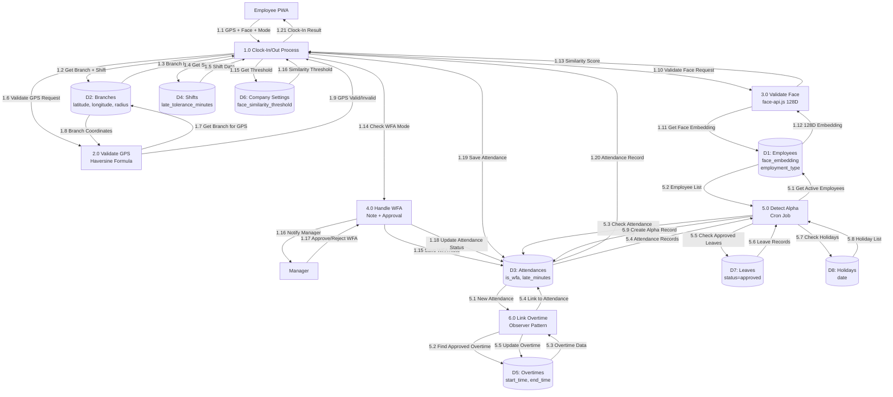

# Data Flow Diagram (DFD) - HRConnect HRIS

## Errata

> **Peringatan:** Catatan berikut mengidentifikasi masalah (bugs, ketidakakuratan, item yang hilang) dalam diagram ini yang harus diperbaiki saat implementasi.

1. **C3: Sanctum not installed** — The API authentication data flow (OAuth Token, PWA authentication) requires `laravel/sanctum` which is not yet installed. All API-facing data flows are broken until Sanctum is set up and `HasApiTokens` is added to the User model.
2. **C4: Permission enum missing** — The authorization data flow (who can access what) is broken without the `Permission` enum and corresponding seeders. `$user->can()` checks will always return false.
3. **ERR-002: Leave balance deducted AFTER full L2 approval** — Process 8.0 "Apply Leave - Deduct Quota" correctly deducts after L2 approval, but implementers must ensure validation-on-submit and deduction-on-approval are two separate steps. The DFD shows P3 (Validate) before submission and P8 (Deduct) after approval.
4. **ERR-007: Weekend = Holiday rate for overtime calculation** — Overtime performed on weekends uses the same rate as holiday overtime (2x/3x/4x tiered rates), not the weekday rate. Process 5.0 "Calculate Overtime Pay" must differentiate weekday vs weekend/holiday rates.

## Deskripsi
Dokumen ini menyajikan Data Flow Diagram (DFD) untuk sistem HRConnect HRIS yang menggambarkan aliran data antara entitas eksternal, proses, dan penyimpanan data. Diagram terdiri dari Level 0 (Context Diagram) yang menunjukkan pandangan menyeluruh sistem, dan Level 1 yang memecah proses inti menjadi sub-proses untuk Attendance, Leave Management, dan Payroll sesuai dengan business rules dalam PRD.

---

## 1. DFD Level 0 - Context Diagram

```mermaid
flowchart LR
    %% External Entities
    E[Employee<br/>PWA Client]
    M[Manager]
    HR[HR Manager]
    F[Finance]
    SA[Super Admin]
    GO[Google OAuth]
    OA[OpenAI API]
    GM[Gemini API]
    NE[Neon PostgreSQL]
    
    %% System
    HRIS[HRConnect HRIS System]
    
    %% Data Flows - Employee
    E -->|1. Clock-In/Out (GPS, Face)| HRIS
    HRIS -->|2. Attendance History| E
    E -->|3. Submit Leave/Overtime| HRIS
    E -->|4. Download Payslip| HRIS
    E -->|5. Chat AI Query| HRIS
    HRIS -->|6. AI Response + Sources| E
    
    %% Data Flows - Manager
    M -->|7. Approve L1 (Leaves/Overtime)| HRIS
    HRIS -->|8. Team Attendance/Leave Data| M
    
    %% Data Flows - HR Manager
    HR -->|9. Manage Employees/Settings| HRIS
    HR -->|10. Approve L2 (Leaves/Overtime)| HRIS
    HR -->|11. Upload KnowledgeBase PDF| HRIS
    HR -->|12. Employee Data/Reports| HR
    
    %% Data Flows - Finance
    F -->|13. Generate Payroll| HRIS
    HRIS -->|14. Payroll Reports| F
    
    %% Data Flows - Super Admin
    SA -->|15. Full System Access/Config| HRIS
    HRIS -->|16. System Logs/Reports| SA
    
    %% Data Flows - External APIs
    %% ⚠️ ERRATA C3: PWA API auth (data flows 1-6) requires laravel/sanctum which is not yet installed
    %% ⚠️ ERRATA C4: Role-based access control (data flows 7-16) requires Permission enum + seeders which are not yet created
    GO -->|17. OAuth Authentication| HRIS
    HRIS -->|18. OAuth Token| GO
    HRIS -->|19. PDF Embedding Request| OA
    OA -->|20. 1536D Embedding| HRIS
    HRIS -->|21. RAG Query + Context| GM
    GM -->|22. AI Generated Response| HRIS
    
    %% Data Flows - Database
    HRIS -->|23. Read/Write Data| NE
    NE -->|24. Retrieved Data| HRIS
```

**Keterangan Aliran Data (Data Flows) Level 0:**

| No | Data Flow | Dari | Ke | Deskripsi |
|----|-----------|------|----|------------|
| 1 | Clock-In/Out | Employee | HRIS | GPS coordinates, face embedding 128D, WFA note |
| 2 | Attendance History | HRIS | Employee | Riwayat kehadiran karyawan |
| 3 | Submit Leave/Overtime | Employee | HRIS | Pengajuan cuti/lembur dengan detail |
| 4 | Download Payslip | HRIS | Employee | PDF E-Payslip (streaming) |
| 5 | Chat AI Query | Employee/HR | HRIS | Pertanyaan untuk KnowledgeBase AI |
| 6 | AI Response + Sources | HRIS | Employee/HR | Jawaban AI + referensi sumber |
| 7 | Approve L1 | Manager | HRIS | Persetujuan Level 1 cuti/lembur |
| 8 | Team Data | HRIS | Manager | Data tim (attendance, leaves, overtimes) |
| 9 | Manage Employees | HR Manager | HRIS | CRUD karyawan, settings, dll |
| 10 | Approve L2 | HR Manager | HRIS | Persetujuan final Level 2 |
| 11 | Upload PDF | HR Manager | HRIS | Upload PDF KnowledgeBase (max 10MB) |
| 12 | HR Reports | HRIS | HR Manager | Laporan karyawan, attendance, dll |
| 13 | Generate Payroll | Finance | HRIS | Trigger payroll generation |
| 14 | Payroll Reports | HRIS | Finance | Laporan payroll, pajak, BPJS |
| 15 | System Config | Super Admin | HRIS | Full access konfigurasi sistem |
| 16 | System Logs | HRIS | Super Admin | Activity logs, audit trails |
| 17 | OAuth Auth | Google OAuth | HRIS | Google Workspace SSO authentication |
| 18 | OAuth Token | HRIS | Google OAuth | Token verifikasi |
| 19 | Embedding Request | HRIS | OpenAI API | Text chunks untuk embedding (text-embedding-3-small) |
| 20 | 1536D Embedding | OpenAI API | HRIS | Vector embedding hasil proses |
| 21 | RAG Query | HRIS | Gemini API | Query + context chunks untuk AI response |
| 22 | AI Response | Gemini API | HRIS | Generated answer + sources |
| 23 | Read/Write Data | HRIS | Neon PostgreSQL | Operasi CRUD database |
| 24 | Retrieved Data | Neon PostgreSQL | HRIS | Data hasil query |

---

## 2. DFD Level 1 - Decomposed: Attendance Process



**Keterangan DFD Level 1 - Attendance Process:**

| Process ID | Nama Proses | Deskripsi | Input | Output |
|------------|-------------|----------|-------|--------|
| 1.0 | Clock-In/Out Process | Main process untuk presensi | GPS, Face, Mode (WFO/WFA) | Attendance record |
| 2.0 | Validate GPS - Haversine | Hitung jarak dengan Haversine formula | Latitude, Longitude, Branch coords | Valid/Invalid |
| 3.0 | Validate Face - 128D | Bandingkan face embedding | Live embedding, Stored embedding (128D) | Similarity score |
| 4.0 | Handle WFA | Proses WFA note + approval | WFA note (min 20 chars) | Status WFA |
| 5.0 | Detect Alpha - Cron | Deteksi karyawan tanpa absen | Employee list, Attendance, Leaves, Holidays | Alpha records |
| 6.0 | Link Overtime | Link overtime ke attendance (Observer) | Attendance clock-out | Updated overtime |

---

## 3. DFD Level 1 - Decomposed: Leave Management Process

```mermaid
flowchart TD
    %% External Entities
    E[Employee]
    M[Manager - L1]
    HR[HR Manager - L2]
    
    %% Processes
    P1[1.0 Submit Leave Request]
    P2[2.0 Calculate Total Days<br/>Exclude Weekend/Holiday]
    P3[3.0 Validate Leave Quota<br/>leave_balances]
    P4[4.0 Check Overlapping<br/>Leave]
    P5[5.0 Create Approval Workflow]
    P6[6.0 Approve L1 - Manager]
    P7[7.0 Approve L2 - HR Manager]
    P8[8.0 Apply Leave<br/>Deduct Quota]
    P9[9.0 Initialize Balance<br/>Pro-rated]
    P10[10.0 Reset Quota<br/>Cron Yearly]
    
    %% Data Stores
    D1[(D1: Employees<br/>parent_id, join_date)]
    D2[(D2: Leave Types<br/>quota, is_paid)]
    D3[(D3: Leaves<br/>start_date, end_date, status)]
    D4[(D4: Leave Balances<br/>quota, used, carry_forward)]
    D5[(D5: Approvals<br/>polymorphic)]
    D6[(D6: Holidays<br/>date)]
    
    %% Data Flows - Submit Leave
    E -->|1.1 Leave Request<br/>leave_type, dates| P1
    P1 -->|1.2 Get Leave Type| D2
    D2 -->|1.3 Leave Type Data| P1
    P1 -->|1.4 Calculate Days| P2
    P2 -->|1.5 Get Holidays| D6
    D6 -->|1.6 Holiday List| P2
    P2 -->|1.7 Total Days (float)| P1
    
    P1 -->|1.8 Validate Quota| P3
    P3 -->|1.9 Get Leave Balance| D4
    D4 -->|1.10 Balance Data| P3
    P3 -->|1.11 Quota Valid/Invalid| P1
    
    P1 -->|1.12 Check Overlap| P4
    P4 -->|1.13 Get Existing Leaves| D3
    D3 -->|1.14 Leave Records| P4
    P4 -->|1.15 Overlap Yes/No| P1
    
    P1 -->|1.16 Save Leave| D3
    P1 -->|1.17 Create Workflow| P5
    
    %% Data Flows - Approval Workflow
    P5 -->|5.1 Get Employee + Parent| D1
    D1 -->|5.2 Employee + Manager Data| P5
    P5 -->|5.3 Create L1 Approval| D5
    P5 -->|5.4 Notify L1| M
    
    M -->|6.1 Approve/Reject L1| P6
    P6 -->|6.2 Update Approval L1| D5
    P6 -->|6.3 Check All L1 Approved| P5
    
    P5 -->|5.5 Create L2 Approval| D5
    P5 -->|5.6 Notify L2| HR
    
    HR -->|7.1 Approve/Reject L2| P7
    P7 -->|7.2 Update Approval L2| D5
    P7 -->|7.3 All Approved?| P8
    
    P8 -->|8.1 Deduct Leave Balance| D4
    %% ⚠️ ERRATA ERR-002: Quota is deducted HERE after full L2 approval (P8), NOT on submission (P3 only validates)
    P8 -->|8.2 Update Leave Status| D3
    P8 -->|8.3 Notify Employee| E
    
    %% Data Flows - Quota Management
    P9 -->|9.1 Get Employee + Leave Types| D1
    D1 -->|9.2 Employee Data| P9
    P9 -->|9.3 Get Leave Types| D2
    D2 -->|9.4 Leave Types List| P9
    P9 -->|9.5 Create Leave Balance| D4
    
    P10 -->|10.1 Reset Quota (Jan 1)| D2
    D2 -->|10.2 Leave Types| P10
    P10 -->|10.3 Reset Used = 0| D4
    P10 -->|10.4 Carry Forward (max 3)| D4
```

**Keterangan DFD Level 1 - Leave Management Process:**

| Process ID | Nama Proses | Deskripsi | Input | Output |
|------------|-------------|----------|-------|--------|
| 1.0 | Submit Leave Request | Input pengajuan cuti | leave_type, dates, day_type | Leave record pending |
| 2.0 | Calculate Total Days | Hitung hari kerja (exclude weekend/holiday) | start_date, end_date, day_type | total_days |
| 3.0 | Validate Leave Quota | Cek sisa kuota cuti | employee, leave_type, days | Valid/Invalid |
| 4.0 | Check Overlapping | Cek overlap dengan cuti existing | dates | Overlap Yes/No |
| 5.0 | Create Approval Workflow | Buat alur approval L1 → L2 | Leave, Employee | Approval records |
| 6.0 | Approve L1 - Manager | Persetujuan Level 1 | Approval, Notes | Updated approval |
| 7.0 | Approve L2 - HR Manager | Persetujuan final Level 2 | Approval, Notes | Updated approval |
| 8.0 | Apply Leave - Deduct Quota | Kurangi kuota cuti | Leave approved | Updated balance |
| 9.0 | Initialize Balance | Inisialisasi saldo cuti (pro-rated) | Employee, Year | Leave balance |
| 10.0 | Reset Quota | Reset kuota tahunan + carry forward | Year | Reset balances |

---

## 4. DFD Level 1 - Decomposed: Payroll Process

```mermaid
flowchart TD
    %% External Entities
    F[Finance]
    E[Employee]
    OA[OpenAI API]
    GM[Gemini API]
    
    %% Processes
    P1[1.0 Generate Payroll<br/>Main Process]
    P2[2.0 Calculate Prorated Salary<br/>PayrollCalculatorService]
    P3[3.0 Calculate PPh21 TER<br/>Kategori A/B/C]
    P4[4.0 Calculate BPJS<br/>Kesehatan + JHT + JP]
    P5[5.0 Calculate Overtime Pay<br/>Rate x Hours]
    Note right of P5: ⚠️ ERRATA ERR-001 & ERR-007: Weekend = Holiday rate.
    Tiered rates: Weekday 1.5x/2x, Holiday 2x/3x/4x. NOT flat rate.
    P6[6.0 Calculate Attendance Penalty<br/>Late + Alpha]
    P7[7.0 Generate E-Payslip PDF<br/>2 Columns]
    P8[8.0 Process KnowledgeBase Embedding<br/>PDF Upload]
    P9[9.0 RAG Chat Query<br/>Vector Similarity]
    
    %% Data Stores
    D1[(D1: Employees<br/>basic_salary, join_date)]
    D2[(D2: Payrolls<br/>gross, pph21, bpjs_*)]
    D3[(D3: Payroll Items<br/>allowance/deduction)]
    D4[(D4: Tax Configs<br/>A/B/C rates)]
    D5[(D5: BPJS Configs<br/>employer/employee rates)]
    D6[(D6: Overtimes<br/>approved, total_hours)]
    D7[(D7: Attendances<br/>status, late_minutes)]
    D8[(D8: Leave Balances<br/>used days)]
    D9[(D9: Loans<br/>active loan)]
    D10[(D10: Company Settings<br/>payroll_cutoff_date)]
    D11[(D11: KnowledgeBases<br/>embedding vector1536)]
    D12[(D12: Holidays<br/>date)]
    
    %% Data Flows - Generate Payroll
    F -->|1.1 Select Period| P1
    P1 -->|1.2 Check Cut-off Date| D10
    D10 -->|1.3 Cut-off Date| P1
    P1 -->|1.4 Get Active Employees| D1
    D1 -->|1.5 Employee List| P1
    
    %% Parallel Processing per Employee (Job)
    P1 -->|1.6 Dispatch Job| P2
    P2 -->|2.1 Get Employee Data| D1
    D1 -->|2.2 Employee Details| P2
    P2 -->|2.3 Count Working Days| D12
    D12 -->|2.4 Holiday List| P2
    P2 -->|2.5 Prorated Salary| P1
    
    P1 -->|1.7 Calculate PPh21| P3
    P3 -->|3.1 Get Employee PTKP| D1
    D1 -->|3.2 Marital Status + Dependents| P3
    P3 -->|3.3 Get TER Category| D4
    D4 -->|3.4 Tax Config (A/B/C)| P3
    P3 -->|3.5 PPh21 Amount| P1
    
    P1 -->|1.8 Calculate BPJS| P4
    P4 -->|4.1 Get BPJS Configs| D5
    D5 -->|4.2 BPJS Rates + Ceiling| P4
    P4 -->|4.3 BPJS Deductions| P1
    
    P1 -->|1.9 Calculate Overtime| P5
    P5 -->|5.1 Get Approved Overtimes| D6
    D6 -->|5.2 Overtime Records| P5
    P5 -->|5.3 Overtime Pay| P1
    
    P1 -->|1.10 Calculate Penalty| P6
    P6 -->|6.1 Get Attendances| D7
    D7 -->|6.2 Attendance Records| P6
    P6 -->|6.3 Penalty Amount| P1
    
    P1 -->|1.11 Calculate Deductions| D9
    D9 -->|1.12 Loan Deduction| P1
    
    P1 -->|1.13 Save Payroll| D2
    P1 -->|1.14 Save Items| D3
    
    P1 -->|1.15 Generate PDF| P7
    P7 -->|7.1 Create PDF 2 Columns| D2
    P7 -->|7.2 PDF Path| P1
    
    P1 -->|1.16 Lock Payroll| D2
    P1 -->|1.17 Notify Employees| E
    
    %% Data Flows - KnowledgeBase AI
    HR -->|8.1 Upload PDF| P8
    P8 -->|8.2 Extract Text| P8
    P8 -->|8.3 Chunking ~60 tokens| P8
    P8 -->|8.4 Request Embedding| OA
    OA -->|8.5 1536D Embedding| P8
    P8 -->|8.6 Save to Vector DB| D11
    
    E -->|9.1 Chat Query| P9
    P9 -->|9.2 Get Query Embedding| OA
    OA -->|9.3 Query Vector 1536D| P9
    P9 -->|9.4 Vector Similarity Search| D11
    D11 -->|9.5 Top-K Chunks| P9
    P9 -->|9.6 Send Context + Query| GM
    GM -->|9.7 AI Response + Sources| P9
    P9 -->|9.8 Display Answer| E
```

**Keterangan DFD Level 1 - Payroll Process:**

| Process ID | Nama Proses | Deskripsi | Input | Output |
|------------|-------------|----------|-------|--------|
| 1.0 | Generate Payroll | Main process payroll generation | Period, Employee list | Published payroll |
| 2.0 | Calculate Prorated Salary | (Hari Aktual / Efektif) × Gaji Pokok | Employee, Period, Holidays | Prorated salary |
| 3.0 | Calculate PPh21 TER | PPh21 per bulan kategori A/B/C | Gross income, PTKP, Tax config | PPh21 amount |
| 4.0 | Calculate BPJS | BPJS Kesehatan, JHT, JP, JKK, JKM | Gross income, BPJS configs | BPJS deductions |
| 5.0 | Calculate Overtime Pay | (Gaji Pokok + Tunjangan) / 173 × Rate | Overtime hours, Employee | Overtime pay ⚠️ ERR-007: Weekend = Holiday rate; tiered per UU Cipta Kerja |
| 6.0 | Calculate Attendance Penalty | Denda keterlambatan + alpha | Attendance records | Penalty amount |
| 7.0 | Generate E-Payslip PDF | 2 kolom Pendapatan/Potongan | Payroll data | PDF file |
| 8.0 | Process KnowledgeBase Embedding | PDF → chunking → OpenAI embedding | PDF file | Vector 1536D in pgvector |
| 9.0 | RAG Chat Query | Vector search → Gemini API → Response | User query | AI answer + sources |

---

## 5. Ringkasan DFD

### Entitas Eksternal (External Entities)
| No | Entitas | Peran | Interaksi Utama |
|----|---------|------|----------------|
| 1 | Employee (PWA) | Pengguna sistem utama | Clock-In/Out, Submit Leave/Overtime, Download Payslip, Chat AI |
| 2 | Manager | Approval Level 1 | Approve L1 Leaves/Overtime, View Team Data |
| 3 | HR Manager | Approval Level 2 + Operasional | Approve L2, Manage Employees, Upload KnowledgeBase |
| 4 | Finance | Payroll Processing | Generate Payroll, View Reports |
| 5 | Super Admin | Full System Access | Config, Audit Logs |
| 6 | Google OAuth | Authentication | SSO Google Workspace |
| 7 | OpenAI API | Embedding Service | text-embedding-3-small (1536D) |
| 8 | Gemini API | LLM Service | Gemini 2.5 Pro untuk RAG |
| 9 | Neon PostgreSQL | Database | Data storage (pgvector) |

### Penyimpanan Data (Data Stores)
| No | Data Store | Isi Utama | Terkait Proses |
|----|------------|-----------|----------------|
| D1 | Employees | face_embedding, basic_salary, parent_id | Attendance, Leave, Payroll |
| D2 | Branches | latitude, longitude, radius | Attendance (GPS) |
| D3 | Attendances | is_wfa, late_minutes, status | Attendance, Payroll |
| D4 | Leaves | start_date, end_date, status | Leave Management |
| D5 | Approvals | polymorphic, level, status | Approval Workflow |
| D6 | Leave Balances | quota, used, carry_forward | Leave Management |
| D7 | Payrolls | gross, pph21, bpjs_*, net | Payroll |
| D8 | Tax Configs | A/B/C, min_income, rate | PPh21 Calculation |
| D9 | BPJS Configs | kesehatan/jht/jp, rates | BPJS Calculation |
| D10 | Company Settings | face_similarity_threshold, cutoff_date | System Config |
| D11 | KnowledgeBases | embedding vector(1536) | AI RAG |
| D12 | Holidays | date, name | Attendance, Leave, Payroll |

### Proses Inti (Processes)
| No | Process ID | Nama Proses | Kategori |
|----|------------|-------------|----------|
| 1 | 1.0 | Clock-In/Out Process | Attendance |
| 2 | 2.0 | Validate GPS - Haversine | Attendance |
| 3 | 3.0 | Validate Face - 128D | Attendance |
| 4 | 4.0 | Handle WFA | Attendance |
| 5 | 5.0 | Detect Alpha - Cron | Attendance |
| 6 | 6.0 | Link Overtime | Attendance |
| 7 | 1.0 | Submit Leave Request | Leave |
| 8 | 2.0 | Calculate Total Days | Leave |
| 9 | 3.0 | Validate Leave Quota | Leave |
| 10 | 4.0 | Check Overlapping | Leave |
| 11 | 5.0 | Create Approval Workflow | Leave/Payroll |
| 12 | 6.0 | Approve L1 - Manager | Leave |
| 13 | 7.0 | Approve L2 - HR Manager | Leave |
| 14 | 8.0 | Apply Leave - Deduct Quota | Leave |
| 15 | 9.0 | Initialize Balance | Leave |
| 16 | 10.0 | Reset Quota - Cron | Leave |
| 17 | 1.0 | Generate Payroll | Payroll |
| 18 | 2.0 | Calculate Prorated Salary | Payroll |
| 19 | 3.0 | Calculate PPh21 TER | Payroll |
| 20 | 4.0 | Calculate BPJS | Payroll |
| 21 | 5.0 | Calculate Overtime Pay | Payroll |
| 22 | 6.0 | Calculate Attendance Penalty | Payroll |
| 23 | 7.0 | Generate E-Payslip PDF | Payroll |
| 24 | 8.0 | Process KnowledgeBase Embedding | AI RAG |
| 25 | 9.0 | RAG Chat Query | AI RAG |

---

## Business Rules Reference (PRD)

1. **Haversine Formula**: Validasi GPS dengan jarak titik ke titik (PRD 2.2, 6.1)
2. **Face Recognition**: face-api.js 128D FaceNet embedding, threshold 0.85 (PRD 2.1)
3. **WFA Mode**: Catatan ≥20 karakter, approval SETELAH clock-in (PRD 6.1)
4. **Leave Calculation**: Exclude Sabtu/Minggu/holidays; morning/afternoon = 0.5 hari (PRD 7.2)
5. **Leave Quota**: Pro-rated tahun pertama, carry forward maksimal 3 hari (PRD 7.3) ⚠️ ERRATA ERR-002: Quota deducted after L2 approval, not on submission
6. **Approval Workflow**: 2 level (L1 Manager → L2 HR Manager), skip L1 jika parent_id NULL (PRD 12.1)
7. **Prorated Salary**: (Hari Kerja Aktual / Hari Kerja Efektif) × Gaji Pokok (PRD 11.3)
8. **PPh21 TER**: Kategori A/B/C berdasarkan PTKP dari marital_status + jumlah anak (PRD 11.4)
9. **BPJS**: Kesehatan 4%/1%, JHT 3.7%/2%, JP 2%/1%, ceiling di bpjs_configs (PRD 11.5)
10. **Payroll Lock**: Status published → LOCKED PERMANEN (PRD 11.7)
11. **KnowledgeBase AI**: PDF max 10MB, chunking 60 token, OpenAI embedding 1536D, Gemini 2.5 Pro (PRD 13.1)
12. **Payroll Queue**: queue: payroll_high, tries: 3, timeout: 120s (PRD 11.9)
13. **Cut-off Date**: Default tanggal 25, join setelah cut-off masuk bulan depan (PRD 11.1)

---

*Terakhir diupdate: 2026-05-13*
