# Deployment Diagram - HRConnect HRIS

## Deskripsi
Dokumen ini menyajikan diagram Deployment UML untuk sistem HRConnect HRIS yang menggambarkan arsitektur fisik dan lingkungan eksekusi aplikasi. Diagram menunjukkan nodes (server, database, client), artifacts (aplikasi, database schema), dan communication paths (HTTP/S, API calls, WebSocket) sesuai dengan spesifikasi teknis dalam PRD.

---

## 1. Deployment Diagram - HRConnect Architecture

```mermaid
C4Deployment
    title Deployment Diagram for HRConnect HRIS
    
    %% Deployment Nodes
    node "Employee Device (PWA Client)" as PWA {
        artifact "HRConnect PWA" as PWAArtifact {
            component "Browser (Chrome/Safari/Firefox)"
            component "face-api.js (Client-side Face Recognition)"
            component "Geolocation API (GPS)"
            component "Service Worker (PWA)"
            component "manifest.json"
            component "Alpine.js (Frontend Interactivity)"
        }
    }
    
    node "VPS (Virtual Private Server)" as VPS {
        deploymentNode "Web Server (Nginx/Apache)" as WebServer {
            artifact "Laravel 13 Application" as LaravelApp {
                component "Livewire 4 (Dynamic UI)"
                component "Flux UI (Component Library)"
                component "Tailwind CSS v4 (Styling)"
                component "Laravel Fortify (Authentication)"
                component "Spatie Permission (RBAC)"
                component "SMTP Email"
            }
        }
        
        deploymentNode "PHP 8.5 Runtime" as PHPRuntime {
            artifact "PHP Application Code" as PHPCode {
                component "PayrollCalculatorService"
                component "AttendanceService"
                component "LeaveService"
                component "ApprovalService"
                component "GenerateEmployeePayrollJob [queue: payroll_high]"
                component "ProcessKnowledgeBaseEmbedding [queue: default]"
                component "AttendanceDetectAlphaCommand"
                component "LeaveResetQuotaCommand"
            }
        }
        
        deploymentNode "Queue Worker" as QueueWorker {
            artifact "Database Queue" as Queue {
                component "payroll_high queue"
                component "default queue"
            }
        }
        
        deploymentNode "Cron Scheduler" as Cron {
            artifact "Scheduled Commands" as CronJobs {
                component "attendance:detect-alpha (23:59 daily)"
                component "leave:reset-quota (Jan 1 00:00)"
                component "model:prune (daily)"
            }
        }
        
        deploymentNode "File Storage" as Storage {
            artifact "storage/app/" as StorageDir {
                component "payslips/{period}/{employee_id}.pdf"
                component "knowledgebase/{filename}.pdf"
                component "profile_photos/"
            }
        }
    }
    
    node "Neon PostgreSQL (Cloud Database)" as DB {
        artifact "PostgreSQL 15+ with Extensions" as PostgresDB {
            component "pgvector (vector similarity)"
            component "pg_trgm (trigram matching)"
            component "pgcrypto (encryption)"
        }
        
        database "HRConnect Database Schema" as DBSchema {
            table "47 Tables (34 existing + 13 new/modified)"
            table "companies, branches, employees, attendances"
            table "leaves, overtimes, payrolls, approvals"
            table "knowledge_bases (embedding vector768)"
            table "company_settings, tax_configs, bpjs_configs"
            table "leave_balances, shift_schedules"
        }
    }
    
    node "External APIs" as ExternalAPIs {
        node "Gemini Embedding API" as GeminiEmbed {
            artifact "text-embedding-004" as GeminiEmbedding {
                component "768-dimension embeddings"
                component "PDF chunking ~60 tokens"
            }
        }
        
        node "Gemini 2.5 Flash API" as Gemini {
            artifact "Gemini LLM" as GeminiLLM {
                component "RAG Response Generation"
                component "Context + Query Processing"
            }
        }
        
        node "SMTP Email" as EmailService2 {
            artifact "Email Service" as EmailArt2 {
                component "Mailtrap (Dev)"
                component "SES/Mailgun (Prod)"
            }
        }
        
        node "Mailtrap / SES / Mailgun" as EmailService {
            artifact "Email Service" as EmailArt {
                component "In-App Notifications"
                component "Email Notifications"
                component "E-Payslip Delivery"
            }
        }
    }
    
    %% Communication Paths
    PWA -->|1. HTTPS (PWA Requests)<br/>Clock-In/Out, Forms, Chat| WebServer
    PWA <-->|2. GPS Coordinates<br/>Geolocation API| PWA
    PWA <-->|3. Face Embedding 128D<br/>face-api.js| PWA
    
    WebServer -->|4. PHP-FPM FastCGI| PHPRuntime
    PHPRuntime -->|5. Eloquent ORM<br/>PDO/PostgreSQL| DB
    PHPRuntime -->|6. Queue Dispatch<br/>Database Queue| QueueWorker
    QueueWorker -->|7. Job Processing<br/>payroll_high, default| PHPRuntime
    PHPRuntime -->|8. Cron Execution| Cron
    Cron -->|9. Scheduled Commands| PHPRuntime
    
    PHPRuntime -->|10. HTTPS API Call<br/>text-embedding-004| GeminiEmbed
    GeminiEmbed -->|11. 768D Embedding| PHPRuntime
    
    PHPRuntime -->|12. HTTPS API Call<br/>RAG Query + Context| Gemini
    Gemini -->|13. AI Response + Sources| PHPRuntime
    
    PHPRuntime -->|14. SMTP<br/>Email Notifications| EmailService2
    EmailService2 -->|15. Email Delivery| PWA
    
    PHPRuntime -->|18. File Storage<br/>PDF Payslips, PDF KnowledgeBase| Storage
    
    note right of PWA: PWA Mobile-First<br/>Bottom Navigation<br/>Offline: DITUNDA (V2)
    note right of VPS: VPS Server<br/>PHP 8.5 + Laravel 13<br/>Queue: database
    note right of DB: Neon PostgreSQL<br/>pgvector + pg_trgm + pgcrypto<br/>CipherSweet Encryption
    note right of GeminiEmbed: Gemini text-embedding-004<br/>768 dimensions<br/>PDF chunking ~60 tokens
    note right of Gemini: Gemini 2.5 Flash API<br/>RAG Response Generation<br/>Don't self-host (avoid OOM)
```

---

## 2. Deployment Diagram - Component View (Alternative)

```mermaid
flowchart TB
    subgraph "Employee Device (PWA Client)"
        PWA1[HRConnect PWA]
        Browser[Browser<br/>Chrome/Safari/Firefox]
        FaceAPI[face-api.js<br/>128D FaceNet]
        GPS[Geolocation API<br/>GPS Coordinates]
        SW[Service Worker<br/>manifest.json]
        
        PWA1 --> Browser
        PWA1 --> FaceAPI
        PWA1 --> GPS
        PWA1 --> SW
    end
    
    subgraph "VPS - Web Server (Nginx/Apache)"
        Laravel[Laravel 13 Application]
        Livewire[Livewire 4<br/>Dynamic UI]
        FluxUI[Flux UI<br/>Component Library]
        Fortify[Laravel Fortify<br/>Authentication]
        Spatie[Spatie Permission<br/>RBAC]
        EmailService2[SMTP Email<br/>Mail Service]
        
        Laravel --> Livewire
        Laravel --> FluxUI
        Laravel --> Fortify
        Laravel --> Spatie
        Laravel --> GoogleSSO
    end
    
    subgraph "VPS - PHP 8.5 Runtime"
        PayrollCalc[PayrollCalculatorService<br/>calculateProratedSalary]
        AttendanceSvc[AttendanceService<br/>validateGPS Haversine]
        LeaveSvc[LeaveService<br/>calculateWorkDays]
        ApprovalSvc[ApprovalService<br/>createApprovalWorkflow]
        PayrollJob[GenerateEmployeePayrollJob<br/>queue: payroll_high]
        EmbeddingJob[ProcessKnowledgeBaseEmbedding<br/>queue: default]
        Cron1[attendance:detect-alpha<br/>dailyAt 23:59]
        Cron2[leave:reset-quota<br/>yearOn Jan 1]
    end
    
    subgraph "VPS - Queue Worker"
        Queue1[payroll_high queue<br/>tries: 3, timeout: 120s]
        Queue2[default queue<br/>tries: 2, timeout: 300s]
    end
    
    subgraph "Neon PostgreSQL (Cloud)"
        PG[PostgreSQL 15+]
        PgVector[pgvector<br/>vector similarity]
        PgTrgm[pg_trgm<br/>trigram matching]
        PgCrypto[pgcrypto<br/>encryption]
        Schema[HRConnect Schema<br/>47 Tables]
        
        PG --> PgVector
        PG --> PgTrgm
        PG --> PgCrypto
        PG --> Schema
    end
    
    subgraph "External APIs"
        OA[Gemini Embedding API<br/>text-embedding-004<br/>768D embedding]
        GM[Gemini 2.5 Flash API<br/>RAG Response<br/>Context + Query]
        SMTP[SMTP<br/>Email Provider]
        EM[Mailtrap/SES<br/>Email Service]
    end
    
    subgraph "VPS - File Storage"
        Storage1[storage/app/payslips/<br/>PDF E-Payslips]
        Storage2[storage/app/knowledgebase/<br/>PDF Documents]
        Storage3[storage/app/profile_photos/<br/>Employee Photos]
    end
    
    %% Communication Paths
    PWA1 <-->|HTTPS<br/>Clock-In/Out<br/>Forms, Chat| Laravel
    Browser <-->|GPS Data| GPS
    Browser <-->|128D Embedding| FaceAPI
    
    Laravel -->|PHP-FPM| PayrollCalc
    Laravel -->|PHP-FPM| AttendanceSvc
    Laravel -->|PHP-FPM| LeaveSvc
    Laravel -->|PHP-FPM| ApprovalSvc
    
    PayrollCalc -->|Dispatch Job| PayrollJob
    PayrollJob -->|queue: payroll_high| Queue1
    Queue1 -->|Process| PayrollCalc
    
    EmbeddingJob -->|queue: default| Queue2
    Queue2 -->|Process| EmbeddingJob
    
    AttendanceSvc -->|Cron| Cron1
    LeaveSvc -->|Cron| Cron2
    
    PayrollCalc -->|Eloquent ORM| PG
    AttendanceSvc -->|Eloquent ORM| PG
    LeaveSvc -->|Eloquent ORM| PG
    ApprovalSvc -->|Eloquent ORM| PG
    
    EmbeddingJob -->|HTTPS API| OA
    OA -->|768D Embedding| EmbeddingJob
    
    LeaveSvc -->|HTTPS API<br/>RAG Query| GM
    GM -->|AI Response + Sources| LeaveSvc
    
    GoogleSSO -->|OAuth 2.0| GO
    GO -->|Token Validation| GoogleSSO
    
    Laravel -->|SMTP| EM
    EM -->|Email Delivery| PWA1
    
    Laravel -->|File Storage| Storage1
    Laravel -->|File Storage| Storage2
```



---

## 3. Network Communication Diagram

```mermaid
flowchart LR
    subgraph "Client Layer"
        E[Employee PWA]
        M[Manager PWA]
        HR[HR Manager Desktop]
        F[Finance Desktop]
        SA[Super Admin Desktop]
    end
    
    subgraph "Application Layer - VPS"
        LB[Load Balancer<br/>Nginx]
        WEB1[Web Server 1<br/>Laravel 13]
        WEB2[Web Server 2<br/>Laravel 13]
        QW[Queue Worker<br/>payroll_high + default]
        CR[Cron Scheduler<br/>Daily + Yearly]
    end
    
    subgraph "Data Layer"
        DB[(Neon PostgreSQL<br/>pgvector + pg_trgm)]
        FS[File Storage<br/>PDF Payslips + PDF KB]
    end
    
    subgraph "External Services"
        OA[Gemini Embedding API<br/>text-embedding-004]
        GM[Gemini 2.5 Flash API<br/>LLM]
        EM[SMTP<br/>Email Provider]
    end
    
    %% Client to Application
    E <-->|HTTPS 443<br/>PWA Requests| LB
    M <-->|HTTPS 443| LB
    HR <-->|HTTPS 443| LB
    F <-->|HTTPS 443| LB
    SA <-->|HTTPS 443| LB
    
    %% Load Balancer to Web Servers
    LB -->|Round Robin<br/>FastCGI| WEB1
    LB -->|Round Robin<br/>FastCGI| WEB2
    
    %% Web Servers to Data Layer
    WEB1 <-->|PDO/PostgreSQL<br/>5432| DB
    WEB2 <-->|PDO/PostgreSQL<br/>5432| DB
    WEB1 <-->|File I/O| FS
    WEB2 <-->|File I/O| FS
    
    %% Queue Worker
    WEB1 -->|Dispatch Job| QW
    WEB2 -->|Dispatch Job| QW
    QW -->|Process Jobs| WEB1
    QW -->|Process Jobs| WEB2
    
    %% Cron Scheduler
    CR -->|Execute Commands| WEB1
    
    %% Application to External Services
    WEB1 -->|HTTPS<br/>text-embedding-004| OA
    WEB2 -->|HTTPS<br/>text-embedding-004| OA
    WEB1 -->|HTTPS<br/>RAG Query| GM
    WEB2 -->|HTTPS<br/>RAG Query| GM
    WEB1 -->|OAuth 2.0| GO
    WEB2 -->|OAuth 2.0| GO
    WEB1 -->|SMTP 587| EM
    WEB2 -->|SMTP 587| EM
    
    note top of E: PWA Mobile-First<br/>face-api.js 128D<br/>Geolocation API
    note right of DB: Neon PostgreSQL<br/>47 Tables<br/>pgvector extension
    note bottom of OA: Gemini text-embedding-004<br/>768D Embedding<br/>PDF max 10MB
    note bottom of GM: Gemini 2.5 Flash<br/>RAG Response<br/>Don't self-host
    
    style E fill:#e1f5ff
    style M fill:#e1f5ff
    style HR fill:#fff4e6
    style F fill:#e8f5e9
    style SA fill:#fce4ec
    style DB fill:#f3e5f5
    style OA fill:#fff9c4
    style GM fill:#c8e6c9
```

---

## 4. Deployment Specifications

### 4.1 VPS Server Requirements

| Komponen | Spesifikasi | Keterangan |
|----------|-------------|------------|
| CPU | 4+ cores | Untuk handle payroll batch processing |
| RAM | 8GB+ | Menghindari OOM saat PDF processing |
| Storage | 50GB+ SSD | Untuk storage PDF payslips + knowledgebase |
| OS | Ubuntu 22.04 LTS | Linux server |
| Web Server | Nginx atau Apache | Reverse proxy + static files |
| PHP | 8.5 | Laravel 13 requirement |
| Database | PostgreSQL 15+ | With pgvector, pg_trgm, pgcrypto extensions |

### 4.2 Neon PostgreSQL Cloud Database

| Fitur | Keterangan |
|--------|------------|
| Type | Cloud PostgreSQL (Neon.tech) |
| Version | PostgreSQL 15+ |
| Extensions | pgvector (vector similarity), pg_trgm (trigram), pgcrypto (encryption) |
| Connection | PDO/PostgreSQL via `.env` |
| Encryption | CipherSweet untuk NIK, phone, NPWP |
| Tables | 47 tables (34 existing + 13 new/modified) |
| Vector Support | 768 dimensions (Gemini text-embedding-004) + 128 dimensions (face-api.js) |

### 4.3 External APIs & Services

| API/Service | Fungsi | Spesifikasi | PRD Reference |
|-------------|--------|-------------|----------------|
| Gemini Embedding API | PDF Embedding | text-embedding-004, 768D | PRD 13.1 |
| Gemini 2.5 Flash | RAG LLM | Context + Query processing | PRD 13.1 |
| — | — | (Google OAuth tidak digunakan) | — |
| Mailtrap/SES/Mailgun | Email | SMTP, In-App + Email notifications | PRD 15.3 |

### 4.4 PWA Client (Employee)

| Komponen | Teknologi | Deskripsi |
|----------|-----------|------------|
| Platform | PWA (Progressive Web App) | Mobile-first, installable |
| Navigation | Bottom Navigation | Beranda, Absensi, Inbox, Profil |
| Face Recognition | face-api.js | Client-side, 128D FaceNet embedding |
| GPS | Geolocation API | Browser GPS, Haversine validation |
| UI Framework | Livewire 4 + Flux UI | Server-side rendering, Alpine.js interactivity |
| Styling | Tailwind CSS v4 | Utility-first CSS |
| Offline | DITUNDA (V2) | IndexedDB sync ditunda |
| Push Notification | DITUNDA (V2) | Notification API ditunda |

### 4.5 Queue & Cron Configuration

| Item | Queue | Tries | Timeout | Backoff | Schedule |
|------|-------|-------|----------|---------|---------|
| GenerateEmployeePayrollJob | payroll_high | 3 | 120s | [10,30,60] | Manual trigger |
| ProcessKnowledgeBaseEmbedding | default | 2 | 300s | - | Manual trigger |
| attendance:detect-alpha | - | - | - | - | dailyAt 23:59 |
| leave:reset-quota | - | - | - | - | yearOn Jan 1 00:00 |
| model:prune | - | - | - | - | daily |

### 4.6 File Storage Structure

```
storage/app/
├── payslips/
│   └── {period}/               # YYYY-MM format
│       └── {employee_id}.pdf   # Generated once at publish
├── knowledgebase/
│   └── {filename}.pdf         # Uploaded HRD, max 10MB
├── profile_photos/
│   └── {employee_id}.jpg      # Employee profile pictures
└── livewire/
    └── tmp/                   # Livewire temporary files
```

### 4.7 Environment Variables (.env)

```
APP_NAME=HRConnect
APP_URL=https://hrconnect.521tech.com

DB_CONNECTION=pgsql
DB_HOST=ep-cool-river-123456.us-east-2.aws.neon.tech
DB_PORT=5432
DB_DATABASE=hrconnect
DB_USERNAME=hrconnect_user
DB_PASSWORD=secret

CACHE_STORE=database
QUEUE_CONNECTION=database

MAIL_MAILER=smtp
MAIL_HOST=smtp.mailtrap.io
MAIL_PORT=2525
MAIL_USERNAME=mailtrap_user
MAIL_PASSWORD=mailtrap_pass

GEMINI_API_KEY=AIzaSyxxxxxxxxxxxxxxxx
-- GOOGLE_CLIENT_ID=xxx — TIDAK DIGUNAKAN

CIPHERSWEET_SECRET_KEY=secret_key_32_bytes
```

---

## 5. Security Architecture

### 5.1 Data Encryption (CipherSweet)

| Table | Encrypted Fields | Blind Index |
|-------|------------------|-------------|
| employees | nik, phone, npwp, bank_account_number | phone_hash, nik_hash, npwp_hash |
| companies | npwp | npwp_hash |
| family_details | nik, phone, address | nik_hash, phone_hash |

### 5.2 Authentication & Session

| Item | Configuration | PRD Reference |
|------|---------------|----------------|
| Login Methods | Email+Password, 2FA TOTP | PRD 4.1 |
| 2FA | TOTP (Optional) | PRD 4.1 |
| Password Policy | Min 8 chars, uppercase+lowercase+number | PRD 4.2 |
| Session Timeout | 120 minutes (2 hours) idle | PRD 4.3 |
| Force Change Password | First login (password_changed = false) | PRD 4.2 |
| Remember Me | Enabled | PRD 4.3 |

### 5.3 Authorization (Spatie Permission)

| Role | Permissions | Level |
|------|-------------|-------|
| Super Admin | All permissions | Full access |
| HR Manager | Employee management, L2 approval, KnowledgeBase | High |
| Finance | Payroll processing, financial reports | Medium |
| Manager | L1 approval, team monitoring | Medium |
| Employee | ESS features, clock-in/out, requests | Basic |

---

## Business Rules Reference (PRD)

1. **Face Recognition**: face-api.js 128D FaceNet embedding di client-side (PRD 2.1)
2. **Haversine Formula**: Server-side GPS validation di AttendanceService (PRD 2.2)
3. **PPh21 TER**: Kategori A/B/C dihitung per bulan (PRD 11.4)
4. **BPJS**: Rates di bpjs_configs dengan ceiling configurable (PRD 11.5)
5. **KnowledgeBase AI**: Gemini text-embedding-004 768D + Gemini 2.5 Flash LLM (PRD 13.1)
6. **Payroll Queue**: queue: payroll_high, tries: 3, timeout: 120s (PRD 11.9)
7. **Approval Workflow**: 2 level (Manager L1 → HR Manager L2) (PRD 12.1)
8. **Cron Jobs**: attendance:detect-alpha (23:59), leave:reset-quota (Jan 1) (PRD 16)
9. **PWA Requirements**: Mobile-first, bottom nav, face-api.js, GPS (PRD 23)
10. — (Google OAuth tidak digunakan)
11. **Neon PostgreSQL**: Cloud database dengan pgvector, pg_trgm, pgcrypto (PRD 2)
12. **CipherSweet**: Enkripsi NIK, phone, NPWP dengan blind index (PRD 17.1)
13. **E-Payslip**: Generate sekali saat publish, streaming download (PRD 11.8)
