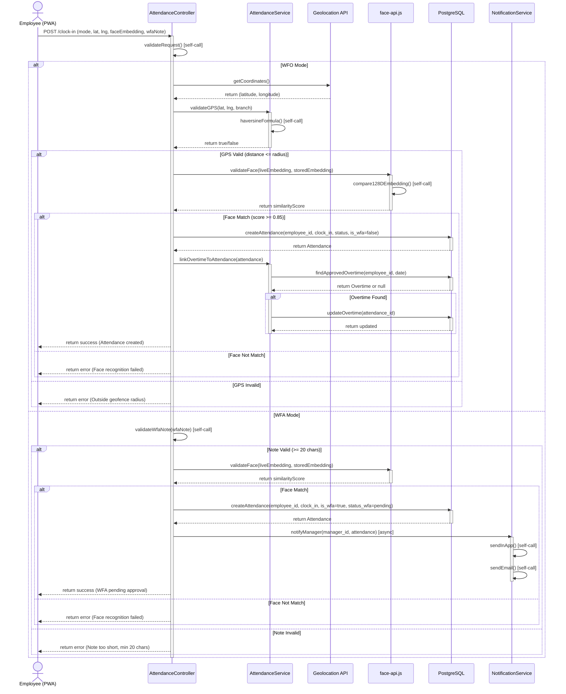
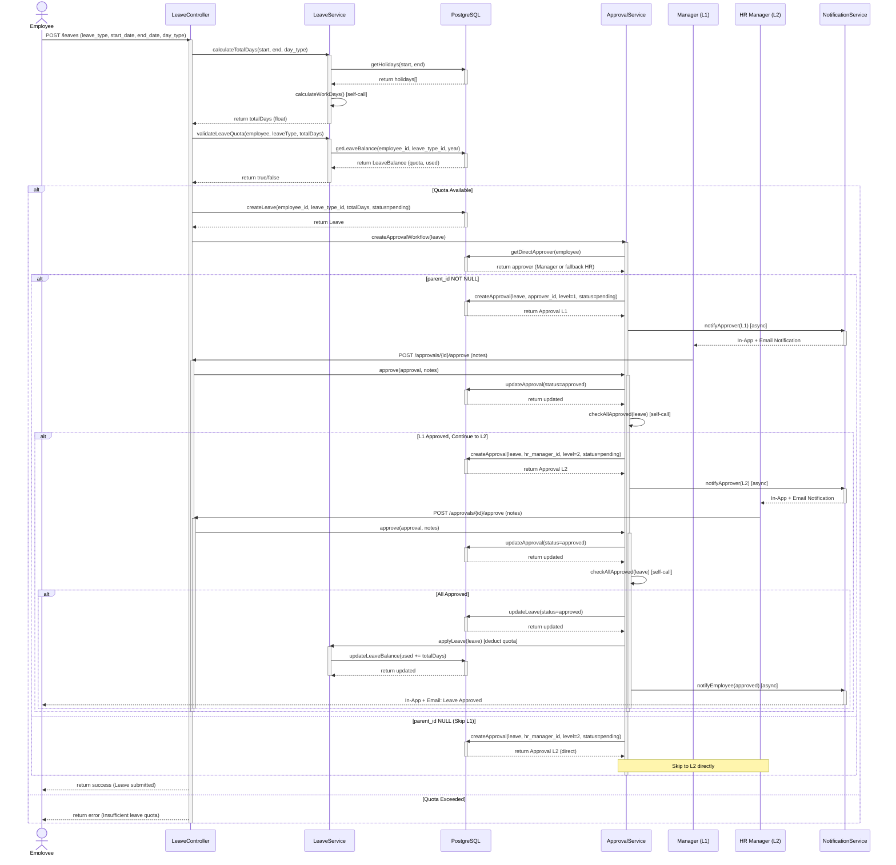
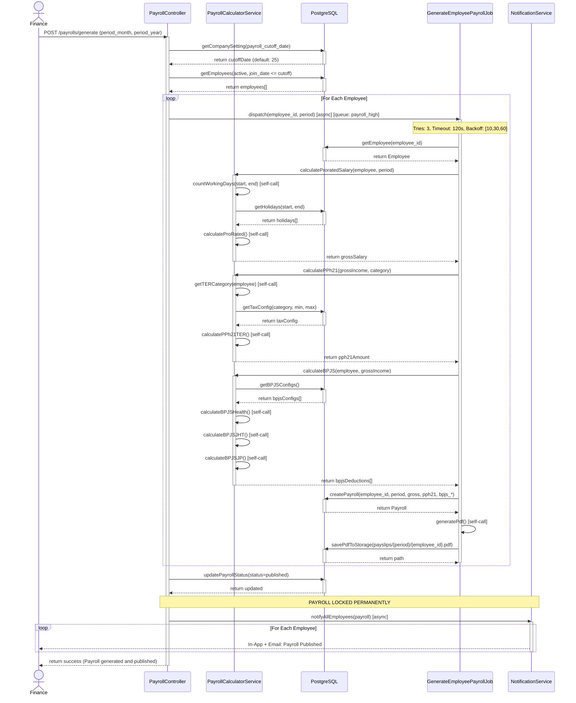
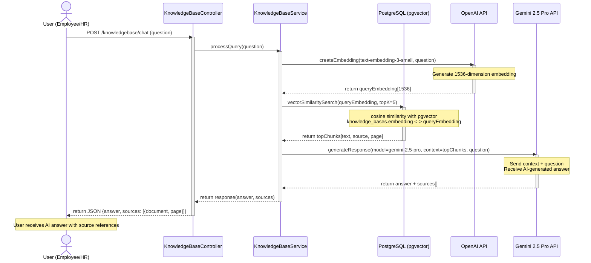
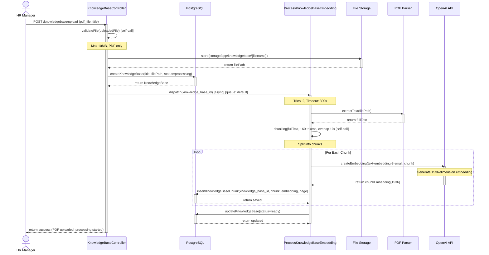

# Sequence Diagrams - HRConnect HRIS

## Deskripsi
Dokumen ini menyajikan diagram Sequence UML untuk sistem HRConnect HRIS yang menggambarkan interaksi antar objek dalam skenario tertentu. Diagram ini menunjukkan message types (sync, async, return, self-call) dan alur komunikasi antara aktor, controller, service classes, models, jobs, dan external APIs sesuai dengan arsitektur yang didefinisikan dalam PRD.

---

## 1. Sequence Diagram - Clock-In Flow (WFO + WFA)

---

## 2. Sequence Diagram - Leave Approval Flow

---

## 3. Sequence Diagram - Payroll Generate Flow

---

## 4. Sequence Diagram - RAG Chat Flow (KnowledgeBase AI)

---

## 5. Sequence Diagram - KnowledgeBase PDF Upload & Embedding

---

## Business Rules Reference (PRD)

1. **Face Recognition**: face-api.js 128D FaceNet embedding, threshold 0.85 (PRD 2.1, 6.1)
2. **Haversine Formula**: Validasi jarak GPS titik ke titik dengan radius tolerance per branch (PRD 2.2)
3. **WFA Mode**: GPS dilewati, catatan ≥20 karakter, approval SETELAH clock-in (PRD 6.1)
4. **Leave Calculation**: Exclude Sabtu/Minggu/holidays; morning/afternoon = 0.5 hari (PRD 7.2)
5. **Leave Quota**: Pro-rated tahun pertama, carry forward maksimal 3 hari (PRD 7.3)
6. **Approval Workflow**: 2 level, skip L1 jika parent_id NULL (PRD 12.1)
7. **Payroll Queue**: queue: payroll_high, tries: 3, timeout: 120s, backoff: [10,30,60] (PRD 11.9)
8. **Prorated Salary**: (Hari Kerja Aktual / Hari Kerja Efektif) × Gaji Pokok (PRD 11.3)
9. **PPh21 TER**: Dihitung per bulan, kategori A/B/C dari PTKP (PRD 11.4)
10. **BPJS**: Kesehatan 4%/1%, JHT 3.7%/2%, JP 2%/1%, ceiling di bpjs_configs (PRD 11.5)
11. **Payroll Lock**: Status published → LOCKED PERMANEN (PRD 11.7)
12. **KnowledgeBase AI**: PDF max 10MB, chunking 60 token, OpenAI embedding 1536D, Gemini 2.5 Pro (PRD 13.1)
13. **Overtime Link**: Saat Clock-Out, Observer link overtime ke attendance (PRD 8.2)
