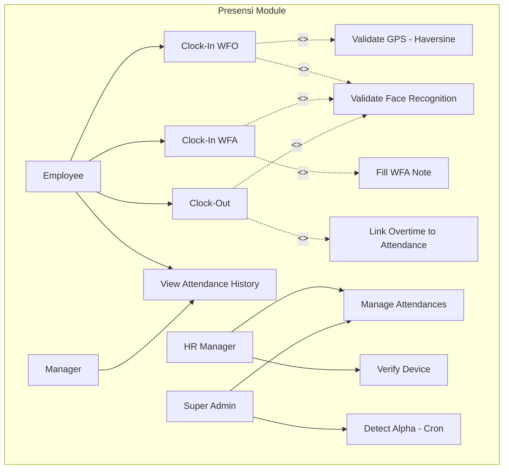
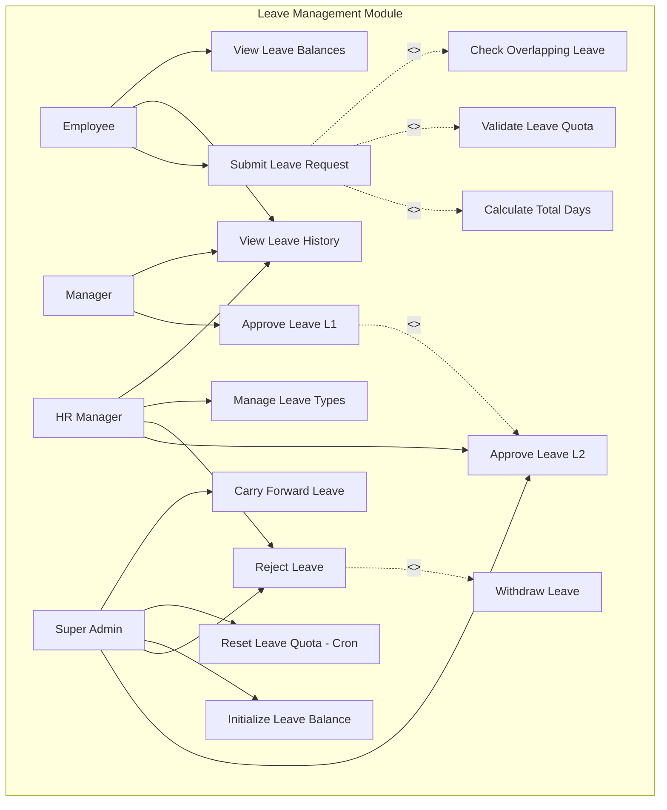
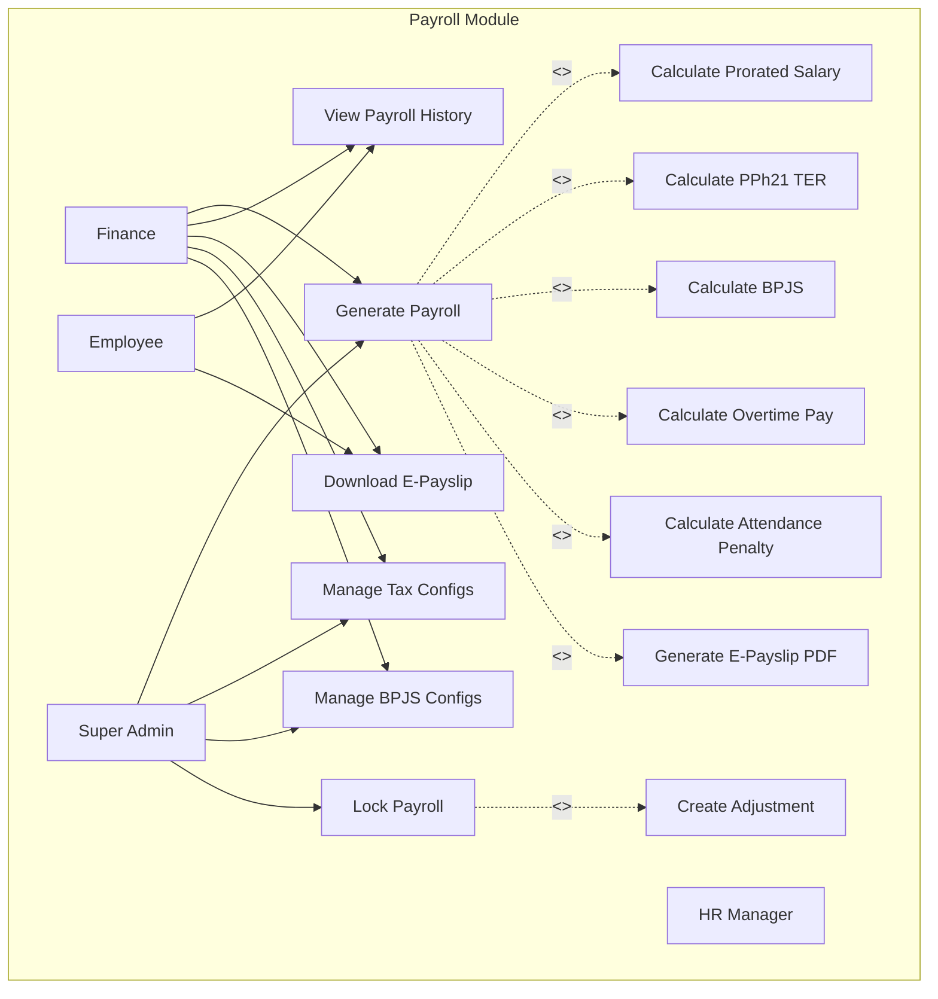
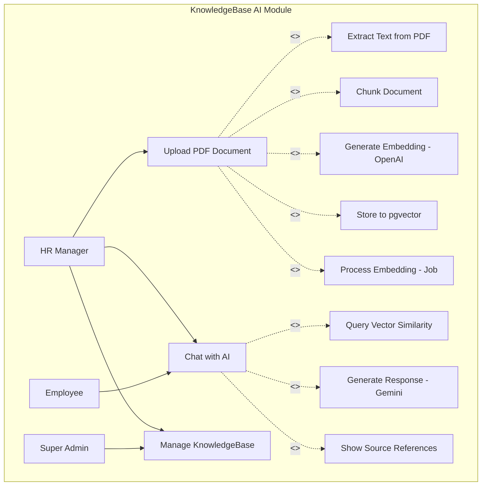
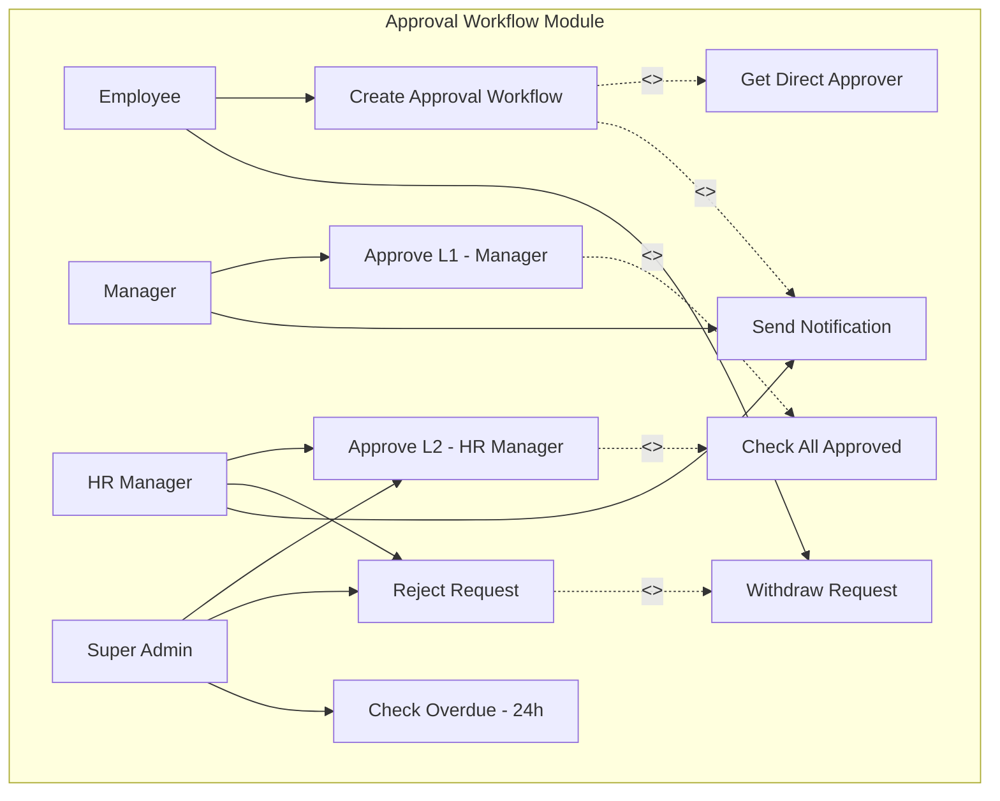

# Use Case Diagram - HRConnect HRIS

## Errata

> **Peringatan:** Catatan berikut mengidentifikasi masalah (bugs, ketidakakuratan, item yang hilang) dalam diagram ini yang harus diperbaiki saat implementasi.

1. **C3: Sanctum not installed** — API use cases (Clock-In PWA, Chat AI Query, etc.) cannot authenticate without `laravel/sanctum`. The `HasApiTokens` trait is missing from the User model. Install Sanctum before implementing API routes.
2. **C4: Permission-based access control broken** — Use cases UC9 (Manage Roles & Permissions), and all role-gated access depends on the `Permission` enum and `RoleAndPermissionSeeder` which have not been created. `$user->can()` will always return false.
3. **ERR-003: Reimbursement L2 approver is Finance, not HR Manager** — In the Approval Workflow Module, L2 approval for Reimbursement use cases should be routed to Finance (not HR Manager). HR Manager is L2 for Leave and Overtime, but Finance is L2 for Reimbursement.

## Deskripsi
Dokumen ini menyajikan diagram Use Case UML untuk sistem HRConnect HRIS yang menggambarkan interaksi antara aktor (Super Admin, HR Manager, Finance, Manager, Employee) dengan sistem. Diagram ini mencakup seluruh fitur yang diimplementasikan dalam PRD versi 2.0.

---

## 1. Use Case Diagram Utama - HRConnect System

```mermaid
graph TD
    %% Aktor
    SA[Super Admin]
    HR[HR Manager]
    F[Finance]
    M[Manager]
    E[Employee]
    
    %% Sistem HRConnect
    subgraph HRConnect System
        %% Master Data
        UC1[Manage Companies]
        UC2[Manage Branches]
        UC3[Manage Departments]
        UC4[Manage Positions]
        UC5[Manage Employees]
        UC6[Manage Shifts]
        UC7[Manage Holidays]
        UC8[Manage Company Settings]
        UC9[Manage Roles & Permissions]
        
        %% Presensi
        UC10[Clock-In/Out]
        UC11[View Attendance History]
        UC12[Manage Attendances]
        UC13[Detect Alpha - Cron]
        
        %% Leave Management
        UC14[Submit Leave Request]
        UC15[View Leave History]
        UC16[Approve Leave L1]
        UC17[Approve Leave L2]
        UC18[Manage Leave Types]
        UC19[View Leave Balances]
        
        %% Overtime
        UC20[Submit Overtime Request]
        UC21[View Overtime History]
        UC22[Approve Overtime L1]
        UC23[Approve Overtime L2]
        UC24[Link Overtime to Attendance]
        
        %% Payroll
        UC25[Generate Payroll]
        UC26[View Payroll History]
        UC27[Download E-Payslip]
        UC28[Manage Tax Configs]
        UC29[Manage BPJS Configs]
        
        %% Approval Workflow
        UC30[Create Approval Workflow]
        UC31[Approve Request]
        UC32[Reject Request]
        UC33[Check Approval Status]
        
        %% KnowledgeBase AI
        UC34[Upload KnowledgeBase PDF]
        UC35[Chat with AI RAG]
        UC36[Manage KnowledgeBase]
        UC37[Process Embedding - Job]
        
        %% Notifications
        UC38[View In-App Notifications]
        UC39[Receive Email Notifications]
        UC40[Send New Device Login Alert]
        
        %% Authentication
        UC41[Login with Email/Password]
        UC42[Login with Google OAuth]
        UC43[Enable/Disable 2FA]
        UC44[Force Change Password]
        UC45[View Activity Logs]
        
        %% Dashboard
        UC46[View Dashboard]
    end
    
    %% Relasi Aktor - Use Case
    SA --> UC1
    SA --> UC2
    SA --> UC3
    SA --> UC4
    SA --> UC5
    SA --> UC6
    SA --> UC7
    SA --> UC8
    SA --> UC9
    SA --> UC12
    SA --> UC17
    SA --> UC23
    SA --> UC25
    SA --> UC26
    SA --> UC28
    SA --> UC29
    SA --> UC32
    SA --> UC36
    SA --> UC45
    SA --> UC46
    
    HR --> UC5
    HR --> UC11
    HR --> UC12
    HR --> UC17
    HR --> UC18
    HR --> UC19
    HR --> UC23
    HR --> UC32
    HR --> UC34
    HR --> UC36
    HR --> UC38
    HR --> UC40
    HR --> UC46
    
    F --> UC25
    F --> UC26
    F --> UC27
    F --> UC46
    
    M --> UC16
    M --> UC22
    M --> UC11
    M --> UC21
    M --> UC46
    
    E --> UC10
    E --> UC11
    E --> UC14
    E --> UC15
    E --> UC19
    E --> UC20
    E --> UC21
    E --> UC27
    E --> UC35
    E --> UC38
    E --> UC41
    E --> UC42
    E --> UC43
    E --> UC44
    
    %% Include Relationships
    UC10 -.->|<<include>>| UC41
    UC10 -.->|<<include>>| UC42
    UC25 -.->|<<include>>| UC30
    UC14 -.->|<<include>>| UC30
    UC20 -.->|<<include>>| UC30
    
    %% Extend Relationships
    UC10 -.->|<<extend>>| UC46
    UC14 -.->|<<extend>>| UC46
    UC20 -.->|<<extend>>| UC46
    UC25 -.->|<<extend>>| UC46
    UC35 -.->|<<extend>>| UC46
    
    %% Cron Jobs
    UC13 -.->|<<include>>| UC12
    UC37 -.->|<<include>>| UC34
    UC24 -.->|<<include>>| UC20
```

---

## 2. Use Case Diagram - Presensi Module

---

## 3. Use Case Diagram - Leave Management Module

---

## 4. Use Case Diagram - Payroll Module

---

## 5. Use Case Diagram - KnowledgeBase AI Module

---

## 6. Use Case Diagram - Approval Workflow Module

---

## Daftar Aktor dan Deskripsi

| Aktor | Deskripsi | Hak Akses Utama |
|-------|-----------|-----------------|
| Super Admin | Pemilik akses penuh ke sistem, master data, konfigurasi, user management | Semua fitur termasuk manage companies, branches, employees, payroll, roles |
| HR Manager | Operasional SDM, approval final cuti/lembur, direktori karyawan, monitoring | Manage employees, approve L2, manage leave types, manage knowledgebase |
| Finance | Payroll, laporan keuangan | Process payroll, view payrolls, manage tax & BPJS configs |
| Manager | Approval Level 1, monitoring tim | Approve L1 leaves & overtimes, view team attendance |
| Employee | ESS - clock-in/out, pengajuan, slip gaji, profil | Clock-in/out, submit leaves & overtimes, view payslips, chat AI |

---

## Business Rules Reference (PRD)

1. **Face Recognition**: Menggunakan face-api.js dengan 128D FaceNet embedding (PRD 2.1)
2. **GPS Geofencing**: Validasi jarak menggunakan Haversine formula dengan radius tolerance per branch (PRD 2.2)
3. **PPh21 TER**: Dihitung per bulan berdasarkan kategori A/B/C dari PTKP (PRD 11.4)
4. **Leave Quota**: Pro-rated tahun pertama, carry forward maksimal 3 hari (PRD 7.3)
5. **WFA Mode**: GPS dilewati, wajib catatan ≥20 karakter, approval setelah clock-in (PRD 6.1)
6. **Approval Workflow**: 2 level (Manager L1 → HR Manager L2), skip L1 jika parent_id NULL (PRD 12.1) ⚠️ ERRATA C1: Approval.level casts to ApprovalLevel enum
7. **KnowledgeBase AI**: PDF max 10MB, chunking 60 token, OpenAI embedding, Gemini 2.5 Pro LLM (PRD 13.1) ⚠️ ERRATA C3: API auth requires laravel/sanctum (not installed)

---

*Terakhir diupdate: 2026-05-13*
