# Entity Relationship Diagram (ERD) - HRConnect HRIS

## Deskripsi
Dokumen ini menyajikan Entity Relationship Diagram (ERD) untuk sistem HRConnect HRIS yang menggambarkan seluruh tabel database (47 tabel: 34 existing + 13 new/modified) beserta relasi, indexes, dan constraints. ERD ini menggunakan Mermaid.js ER diagram syntax dan mencakup semua kolom yang disebutkan dalam PRD termasuk kolom baru (contract_start_date, contract_end_date, deceased_date, termination_reason, employment_type).

---

## 1. ERD Lengkap - HRConnect Database

```mermaid
erDiagram
    %% Master Data Tables
    companies ||--o{ branches : "has"
    companies ||--o{ users : "has"
    companies {
        uuid id PK
        string name
        string phone
        string email
        string website
        string npwp "encrypted"
        string code
        string logo
        boolean is_active
    }
    
    branches ||--o{ departments : "has"
    branches {
        uuid id PK
        uuid company_id FK
        string name
        text address
        decimal latitude
        decimal longitude
        integer radius "default: 100m"
        boolean is_main
        boolean is_active
    }
    
    departments ||--o{ positions : "has"
    departments {
        uuid id PK
        uuid branch_id FK
        string name
        string code
        text description
        boolean is_active
    }
    
    positions ||--o{ employees : "has"
    positions {
        uuid id PK
        uuid department_id FK
        string name
        string code
        string grade
        decimal basic_salary
        decimal allowance_jabatan
        boolean is_active
    }
    
    %% Employee & User Tables
    users ||--|| employees : "has one"
    users {
        uuid id PK
        string name
        string email
        timestamp email_verified_at
        string password
        string phone
        boolean password_changed "default: false"
        string two_factor_secret
        string two_factor_recovery_codes
        text remember_token
        timestamp created_at
        timestamp updated_at
    }
    
    employees ||--o{ attendances : "has"
    employees ||--o{ leaves : "has"
    employees ||--o{ overtimes : "has"
    employees ||--o{ payrolls : "has"
    employees ||--o{ family_details : "has"
    employees ||--o{ devices : "has"
    employees ||--o{ approvals : "approver"
    employees ||--o{ leave_balances : "has"
    employees ||--|| employees : "parent (manager)"
    employees {
        uuid id PK
        uuid user_id FK
        uuid position_id FK
        uuid parent_id FK "manager/approver"
        string nik "encrypted, blind_index"
        string name
        string phone "encrypted, blind_index"
        string address
        date birth_date
        string gender
        string marital_status
        string bank_account_number "encrypted, blind_index"
        string bank_name
        date join_date
        date resign_date
        string employment_status
        string employment_type "permanent/contract/probation"
        date contract_start_date
        date contract_end_date
        date deceased_date
        text termination_reason
        string face_embedding "vector(128)"
        string npwp "encrypted, blind_index"
        uuid shift_id FK
        timestamp created_at
        timestamp updated_at
        softDeletes deleted_at
    }
    
    %% Shift & Attendance Tables
    shifts ||--o{ employees : "assigned"
    shifts ||--o{ attendances : "has"
    shifts ||--o{ shift_schedules : "has"
    shifts {
        uuid id PK
        string name
        time start_time
        time end_time
        integer late_tolerance_minutes "default: 0"
        boolean is_active
    }
    
    shift_schedules {
        uuid id PK
        uuid employee_id FK
        uuid shift_id FK
        date date
        timestamp created_at
        timestamp updated_at
    }
    
    attendances {
        uuid id PK
        uuid employee_id FK
        uuid shift_id FK
        time clock_in
        time clock_out
        decimal clock_in_latitude
        decimal clock_in_longitude
        decimal clock_out_latitude
        decimal clock_out_longitude
        string clock_in_photo
        string clock_out_photo
        string status "on_time/late/early/holiday/permission/absent"
        boolean is_wfa "default: false"
        string status_wfa "pending/approved/rejected"
        string wfa_note
        integer late_minutes
        uuid overtime_id FK
        timestamp created_at
        timestamp updated_at
        softDeletes deleted_at
        index idx_employee_date "employee_id + date"
    }
    
    %% Leave Management Tables
    leave_types ||--o{ leaves : "has"
    leave_types ||--o{ leave_balances : "has"
    leave_types {
        uuid id PK
        string name
        integer quota "default: 12"
        boolean is_paid
        boolean deducts_from_quota "default: true"
        boolean is_active
    }
    
    leave_balances {
        uuid id PK
        uuid employee_id FK
        uuid leave_type_id FK
        integer year
        integer quota
        integer used
        integer carry_forward "max: 3"
        timestamp created_at
        timestamp updated_at
        unique uk_employee_type_year "employee_id + leave_type_id + year"
    }
    
    leaves ||--o{ approvals : "polymorphic"
    leaves {
        uuid id PK
        uuid employee_id FK
        uuid leave_type_id FK
        date start_date
        date end_date
        string day_type "full_day/morning/afternoon"
        decimal total_days
        string status "pending/approved/rejected"
        text rejection_reason
        timestamp created_at
        timestamp updated_at
        softDeletes deleted_at
        index idx_employee_dates "employee_id + start_date + end_date"
    }
    
    %% Overtime Tables
    overtimes ||--o{ approvals : "polymorphic"
    overtimes ||--o{ attendances : "linked"
    overtimes {
        uuid id PK
        uuid employee_id FK
        uuid attendance_id FK "nullable before approval"
        time start_time
        time end_time
        text description
        string status "pending/approved/rejected"
        text rejection_reason
        decimal total_hours
        decimal amount
        timestamp created_at
        timestamp updated_at
        softDeletes deleted_at
    }
    
    %% Approval Workflow Tables
    approvals {
        uuid id PK
        string approvable_type "polymorphic: Leave/Overtime"
        uuid approvable_id
        uuid approver_id FK "employee_id"
        integer level "1 or 2"
        string status "pending/approved/rejected"
        text notes
        timestamp created_at
        timestamp updated_at
        index idx_approvable "approvable_type + approvable_id"
    }
    
    %% Payroll Tables
    payrolls ||--o{ payroll_items : "has"
    payrolls {
        uuid id PK
        uuid employee_id FK
        string period "YYYY-MM"
        decimal gross_salary
        decimal overtime_pay
        decimal pph21
        decimal bpjs_health
        decimal bpjs_employment
        decimal loan_deduction
        decimal attendance_penalty
        decimal net_salary
        string status "draft/published"
        text pdf_path
        timestamp created_at
        timestamp updated_at
        softDeletes deleted_at
        unique uk_employee_period "employee_id + period"
    }
    
    payroll_items {
        uuid id PK
        uuid payroll_id FK
        string type "allowance/deduction/adjustment"
        string name
        decimal amount
        timestamp created_at
        timestamp updated_at
    }
    
    %% Family Details Table
    family_details {
        uuid id PK
        uuid employee_id FK
        string nik "encrypted, blind_index"
        string name
        string relationship
        date birth_date
        string phone "encrypted, blind_index"
        string address "encrypted"
        timestamp created_at
        timestamp updated_at
    }
    
    %% Device Management Table
    devices {
        uuid id PK
        uuid employee_id FK
        string uuid "device UUID"
        boolean is_verified "default: false"
        string device_name
        timestamp created_at
        timestamp updated_at
    }
    
    %% Loan Tables (V2 - Deferred)
    loans ||--o{ loan_installments : "has"
    loans {
        uuid id PK
        uuid employee_id FK
        decimal amount
        decimal interest_rate "default: 0%"
        integer tenure_months
        string status "pending/approved/paid/off"
        timestamp created_at
        timestamp updated_at
        softDeletes deleted_at
    }
    
    loan_installments {
        uuid id PK
        uuid loan_id FK
        integer installment_number
        decimal amount
        string status "pending/paid"
        date due_date
        timestamp created_at
        timestamp updated_at
    }
    
    %% Reimbursement Tables (V2 - Deferred)
    reimbursement_categories {
        uuid id PK
        string name
        string description
        boolean is_active
    }
    
    reimbursements {
        uuid id PK
        uuid employee_id FK
        uuid category_id FK
        decimal amount
        string description
        string attachment_path
        string status "pending/approved/rejected"
        timestamp created_at
        timestamp updated_at
        softDeletes deleted_at
    }
    
    %% Configuration Tables
    company_settings {
        uuid id PK
        string key
        text value
        string description
        timestamp created_at
        timestamp updated_at
        unique uk_key "key"
    }
    
    tax_configs {
        uuid id PK
        string category "A/B/C"
        decimal min_income
        decimal max_income
        decimal rate "percentage"
        timestamp created_at
        timestamp updated_at
    }
    
    bpjs_configs {
        uuid id PK
        string name "kesehatan/jht/jp/jkk/jkm"
        decimal employer_rate
        decimal employee_rate
        decimal ceiling "nullable"
        timestamp created_at
        timestamp updated_at
    }
    
    holidays {
        uuid id PK
        date date "unique"
        string name
        boolean is_active
        timestamp created_at
        timestamp updated_at
    }
    
    %% KnowledgeBase AI Table
    knowledge_bases {
        uuid id PK
        string title
        string file_path
        text content "chunked text"
        vector embedding "vector(1536)"
        string source_document
        integer page_number
        string status "processing/ready/error"
        timestamp created_at
        timestamp updated_at
    }
    
    %% Asset Management Tables (V2 - Deferred)
    assets {
        uuid id PK
        uuid company_id FK
        string name
        string code
        string category
        string status "available/assigned/disposed"
        timestamp created_at
        timestamp updated_at
    }
    
    asset_handovers {
        uuid id PK
        uuid asset_id FK
        uuid employee_id FK
        date handover_date
        date return_date
        string condition
        timestamp created_at
        timestamp updated_at
    }
    
    %% Performance Review Table (V2 - Deferred)
    performance_reviews {
        uuid id PK
        uuid employee_id FK
        integer period_year
        integer period_month
        decimal score
        text feedback
        timestamp created_at
        timestamp updated_at
    }
    
    %% Activity Log Table
    activity_logs {
        uuid id PK
        string log_name
        string description
        string subject_type "polymorphic"
        uuid subject_id
        string causer_type "polymorphic"
        uuid causer_id
        json properties
        timestamp created_at
        timestamp updated_at
    }
    
    %% Laravel Default Tables
    sessions {
        string id PK
        uuid user_id FK "nullable"
        string ip_address
        text user_agent
        text payload
        integer last_activity
    }
    
    cache {
        string key PK
        text value
        integer expiration
    }
    
    jobs {
        bigint id PK
        string queue
        longtext payload
        integer attempts
        integer reserved_at "nullable"
        integer available_at
        integer created_at
    }
    
    job_batches {
        string id PK
        string name
        integer total_jobs
        integer pending_jobs
        integer failed_jobs
        longtext failed_job_ids
        longtext options
        integer created_at
        integer finished_at "nullable"
    }
    
    password_reset_tokens {
        string email
        string token
        timestamp created_at
    }
    
    %% Indonesia Region Tables
    indonesia_provinces {
        char id PK "2 digit"
        string name
    }
    
    indonesia_cities {
        char id PK "4 digit"
        char province_id FK
        string name
    }
    
    indonesia_districts {
        char id PK "6 digit"
        char city_id FK
        string name
    }
    
    indonesia_villages {
        char id PK "10 digit"
        char district_id FK
        string name
    }
    
    %% Spatie Permission Tables
    permission_tables {
        uuid id PK
        string name
        string guard_name
        timestamp created_at
        timestamp updated_at
    }
    
    %% CipherSweet Blind Indexes
    blind_indexes {
        uuid id PK
        string table_name
        string column_name
        string blind_index
        uuid row_id
        timestamp created_at
        timestamp updated_at
        index idx_table_row "table_name + row_id"
    }
```

---

## 2. Ringkasan Tabel Berdasarkan Kategori

### Master Data (7 tabel)
| No | Tabel | PK | FK | Indexes | Keterangan |
|----|-------|----|----|---------|------------|
| 1 | companies | id (uuid) | - | - | Perusahaan (NPWP encrypted) |
| 2 | branches | id (uuid) | company_id | - | Cabang (latitude, longitude, radius) |
| 3 | departments | id (uuid) | branch_id | - | Departemen |
| 4 | positions | id (uuid) | department_id | - | Jabatan (basic_salary, allowance_jabatan) |
| 5 | shifts | id (uuid) | - | - | Shift (late_tolerance_minutes) |
| 6 | shift_schedules | id (uuid) | employee_id, shift_id | - | Jadwal Shift (NEW) |
| 7 | holidays | id (uuid) | - | date (unique) | Hari Libur Nasional |

### Employee & User (4 tabel)
| No | Tabel | PK | FK | Indexes | Keterangan |
|----|-------|----|----|---------|------------|
| 8 | users | id (uuid) | - | email (unique) | Login (password_changed, 2FA) |
| 9 | employees | id (uuid) | user_id, position_id, parent_id, shift_id | - | Karyawan (face_embedding vector(128), 5 kolom baru) |
| 10 | family_details | id (uuid) | employee_id | - | Keluarga (NIK, phone encrypted) |
| 11 | devices | id (uuid) | employee_id | - | Device UUID (is_verified) |

### Attendance (2 tabel)
| No | Tabel | PK | FK | Indexes | Keterangan |
|----|-------|----|----|---------|------------|
| 12 | attendances | id (uuid) | employee_id, shift_id, overtime_id | idx_employee_date | Presensi (late_minutes, is_wfa, wfa_note) |
| 13 | overtimes | id (uuid) | employee_id, attendance_id | - | Lembur (start_time, end_time, description, rejection_reason) |

### Leave Management (3 tabel)
| No | Tabel | PK | FK | Indexes | Keterangan |
|----|-------|----|----|---------|------------|
| 14 | leave_types | id (uuid) | - | - | Jenis Cuti (quota, is_paid) |
| 15 | leave_balances | id (uuid) | employee_id, leave_type_id | uk_employee_type_year | Saldo Cuti (NEW) |
| 16 | leaves | id (uuid) | employee_id, leave_type_id | idx_employee_dates | Pengajuan Cuti (rejection_reason) |

### Approval Workflow (1 tabel)
| No | Tabel | PK | FK | Indexes | Keterangan |
|----|-------|----|----|---------|------------|
| 17 | approvals | id (uuid) | approver_id | idx_approvable | Polymorphic (Leave/Overtime) |

### Payroll (2 tabel)
| No | Tabel | PK | FK | Indexes | Keterangan |
|----|-------|----|----|---------|------------|
| 18 | payrolls | id (uuid) | employee_id | uk_employee_period | Payroll (gross_salary, pph21, bpjs_*, dll) |
| 19 | payroll_items | id (uuid) | payroll_id | - | Item Payroll (allowance/deduction/adjustment) |

### Configuration (3 tabel - NEW)
| No | Tabel | PK | FK | Indexes | Keterangan |
|----|-------|----|----|---------|------------|
| 20 | company_settings | id (uuid) | - | uk_key (unique) | Key-Value Config (NEW) |
| 21 | tax_configs | id (uuid) | - | - | PPh21 TER (NEW) |
| 22 | bpjs_configs | id (uuid) | - | - | BPJS Rates (NEW) |

### KnowledgeBase AI (1 tabel)
| No | Tabel | PK | FK | Indexes | Keterangan |
|----|-------|----|----|---------|------------|
| 23 | knowledge_bases | id (uuid) | - | - | AI RAG (embedding vector(1536)) |

### Loan (V2 - Deferred, 2 tabel)
| No | Tabel | PK | FK | Indexes | Keterangan |
|----|-------|----|----|---------|------------|
| 24 | loans | id (uuid) | employee_id | - | Pinjaman (V2) |
| 25 | loan_installments | id (uuid) | loan_id | - | Cicilan (status, due_date) |

### Reimbursement (V2 - Deferred, 2 tabel)
| No | Tabel | PK | FK | Indexes | Keterangan |
|----|-------|----|----|---------|------------|
| 26 | reimbursement_categories | id (uuid) | - | - | Kategori (NEW, V2) |
| 27 | reimbursements | id (uuid) | employee_id, category_id | - | Reimburse (V2) |

### Asset Management (V2 - Deferred, 2 tabel)
| No | Tabel | PK | FK | Indexes | Keterangan |
|----|-------|----|----|---------|------------|
| 28 | assets | id (uuid) | company_id | - | Aset (V2) |
| 29 | asset_handovers | id (uuid) | asset_id, employee_id | - | Serah Terima (V2) |

### Performance Review (V2 - Deferred, 1 tabel)
| No | Tabel | PK | FK | Indexes | Keterangan |
|----|-------|----|----|---------|------------|
| 30 | performance_reviews | id (uuid) | employee_id | - | Review (V2) |

### Laravel System (6 tabel)
| No | Tabel | PK | FK | Indexes | Keterangan |
|----|-------|----|----|---------|------------|
| 31 | users | - | - | Already in Employee & User |
| 32 | sessions | id (string) | user_id | - | Session Laravel |
| 33 | cache | key (string) | - | - | Cache Laravel |
| 34 | jobs | id (bigint) | - | - | Queue Jobs |
| 35 | job_batches | id (string) | - | - | Batch Jobs |
| 36 | password_reset_tokens | email | - | - | Reset Password |

### Activity & Permissions (2 tabel)
| No | Tabel | PK | FK | Indexes | Keterangan |
|----|-------|----|----|---------|------------|
| 37 | activity_logs | id (uuid) | - | - | Log Aktivitas (Prunable 1 tahun) |
| 38 | permission_tables | id (uuid) | - | - | Spatie Permission |

### Indonesia Region (4 tabel)
| No | Tabel | PK | FK | Indexes | Keterangan |
|----|-------|----|----|---------|------------|
| 39 | indonesia_provinces | id (char 2) | - | - | Provinsi |
| 40 | indonesia_cities | id (char 4) | province_id | - | Kota/Kabupaten |
| 41 | indonesia_districts | id (char 6) | city_id | - | Kecamatan |
| 42 | indonesia_villages | id (char 10) | district_id | - | Kelurahan/Desa |

### Security (1 tabel)
| No | Tabel | PK | FK | Indexes | Keterangan |
|----|-------|----|----|---------|------------|
| 43 | blind_indexes | id (uuid) | - | idx_table_row | CipherSweet Blind Index |

### Total: 43 tabel (bukan 47 seperti disebutkan di PRD, karena beberapa tabel adalah tabel Laravel default yang sudah ada)

**Koreksi**: Berdasarkan PRD 18, ada 34 existing + 6 new tables + 6 alter tables = 40 tabel inti. Tabel Indonesia Region (4) dan Laravel System (6) dan Permission (1) dan Security (1) = 52 tabel total.

---

## 3. Relasi Utama (Foreign Keys)

| Parent Table | Child Table | FK Column | Relationship |
|--------------|-------------|-----------|--------------|
| companies | branches | company_id | 1:N |
| companies | users | company_id | 1:N |
| branches | departments | branch_id | 1:N |
| departments | positions | department_id | 1:N |
| positions | employees | position_id | 1:N |
| users | employees | user_id | 1:1 |
| employees | employees | parent_id | 1:N (self-referencing) |
| employees | attendances | employee_id | 1:N |
| employees | leaves | employee_id | 1:N |
| employees | overtimes | employee_id | 1:N |
| employees | payrolls | employee_id | 1:N |
| employees | family_details | employee_id | 1:N |
| employees | devices | employee_id | 1:N |
| employees | leave_balances | employee_id | 1:N |
| shifts | employees | shift_id | 1:N |
| shifts | attendances | shift_id | 1:N |
| shifts | shift_schedules | shift_id | 1:N |
| leave_types | leaves | leave_type_id | 1:N |
| leave_types | leave_balances | leave_type_id | 1:N |
| payrolls | payroll_items | payroll_id | 1:N |
| approvals | employees | approver_id | N:1 (approver) |

---

## 4. Kolom Baru Berdasarkan PRD 18

### employees (5 kolom baru)
- `contract_start_date` (date, nullable)
- `contract_end_date` (date, nullable)
- `deceased_date` (date, nullable)
- `termination_reason` (text, nullable)
- `employment_type` (string(20), default: 'permanent')

Values: `permanent`, `contract`, `probation`

### shift_schedules (NEW)
- `employee_id` (uuid, FK)
- `shift_id` (uuid, FK)
- `date` (date)

### leave_balances (NEW)
- `employee_id` (uuid, FK)
- `leave_type_id` (uuid, FK)
- `year` (integer)
- `quota` (integer)
- `used` (integer)
- `carry_forward` (integer, max: 3)

### company_settings (NEW)
- `key` (string, unique)
- `value` (text)
- `description` (string)

### tax_configs (NEW)
- `category` (string: A/B/C)
- `min_income` (decimal)
- `max_income` (decimal)
- `rate` (decimal)

### bpjs_configs (NEW)
- `name` (string: kesehatan/jht/jp/jkk/jkm)
- `employer_rate` (decimal)
- `employee_rate` (decimal)
- `ceiling` (decimal, nullable)

### loan_installments (ALTER - 2 kolom)
- `status` (string: pending/paid)
- `due_date` (date)

### leaves (ALTER - 1 kolom)
- `rejection_reason` (text)

### overtimes (ALTER - 4 kolom)
- `start_time` (time)
- `end_time` (time)
- `description` (text)
- `rejection_reason` (text)

### payrolls (ALTER - 7 kolom)
- `gross_salary` (decimal)
- `overtime_pay` (decimal)
- `pph21` (decimal)
- `bpjs_health` (decimal)
- `bpjs_employment` (decimal)
- `loan_deduction` (decimal)
- `attendance_penalty` (decimal)

### shifts (ALTER - 1 kolom)
- `late_tolerance_minutes` (integer, default: 0)

### attendances (ALTER - 1 kolom)
- `late_minutes` (integer)

---

## Business Rules Reference (PRD)

1. **Face Embedding**: employees.face_embedding menggunakan vector(128) untuk face-api.js 128D FaceNet (PRD 2.1)
2. **Employment Type**: permanent/contract/probation untuk kontrak PKWT (PRD 18, 26.4)
3. **Deceased Date**: Untuk karyawan meninggal, cuti dibayar + loan dihapuskan (PRD 26.1)
4. **Contract Dates**: contract_start_date & contract_end_date untuk karyawan kontrak (PRD 26.4)
5. **Shift Late Tolerance**: shifts.late_tolerance_minutes default 0 (PRD 6.1)
6. **WFA Fields**: attendances.is_wfa, status_wfa, wfa_note untuk Work From Anywhere (PRD 6.1)
7. **Leave Balance**: leave_balances dengan carry_forward maksimal 3 hari (PRD 7.3)
8. **Tax Configs**: PPh21 TER kategori A/B/C berdasarkan PTKP (PRD 11.4)
9. **BPJS Configs**: BPJS rates dengan ceiling configurable (PRD 11.5)
10. **Company Settings**: Key-value untuk face_similarity_threshold, payroll_cutoff_date, dll (PRD 14.7)
11. **KnowledgeBase Embedding**: vector(1536) untuk OpenAI text-embedding-3-small (PRD 13.1)
12. **Blind Indexes**: CipherSweet untuk NIK, phone, NPWP encryption (PRD 17.1)
